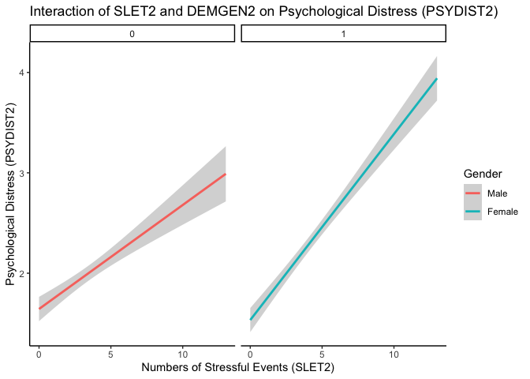
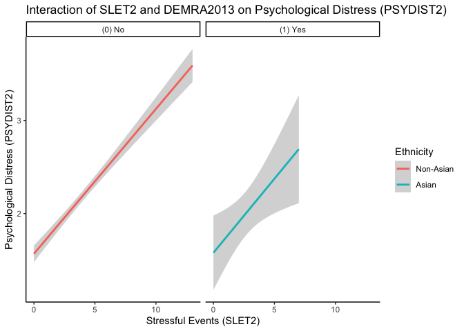

My project
================
2024-10-24

# load packages and dataset

``` r
# Set a CRAN mirror before installing packages
options(repos = c(CRAN = "https://cloud.r-project.org"))

# Install and load the moments package
install.packages("moments")
```

    ## 
    ## The downloaded binary packages are in
    ##  /var/folders/qv/j1c01f7x2l9ctjb7ps7yhmsr0000gn/T//RtmpurMu3b/downloaded_packages

``` r
library(moments)
library(haven) #to download the package
library(dplyr) #re-code variable
```

    ## 
    ## Attaching package: 'dplyr'

    ## The following objects are masked from 'package:stats':
    ## 
    ##     filter, lag

    ## The following objects are masked from 'package:base':
    ## 
    ##     intersect, setdiff, setequal, union

``` r
library(ggplot2)
library(bruceR)
```

    ## 
    ## bruceR (v2024.6)
    ## Broadly Useful Convenient and Efficient R functions
    ## 
    ## Packages also loaded:
    ## ✔ data.table ✔ emmeans
    ## ✔ dplyr      ✔ lmerTest
    ## ✔ tidyr      ✔ effectsize
    ## ✔ stringr    ✔ performance
    ## ✔ ggplot2    ✔ interactions
    ## 
    ## Main functions of `bruceR`:
    ## cc()             Describe()  TTEST()
    ## add()            Freq()      MANOVA()
    ## .mean()          Corr()      EMMEANS()
    ## set.wd()         Alpha()     PROCESS()
    ## import()         EFA()       model_summary()
    ## print_table()    CFA()       lavaan_summary()
    ## 
    ## For full functionality, please install all dependencies:
    ## install.packages("bruceR", dep=TRUE)
    ## 
    ## Online documentation:
    ## https://psychbruce.github.io/bruceR
    ## 
    ## To use this package in publications, please cite:
    ## Bao, H.-W.-S. (2024). bruceR: Broadly useful convenient and efficient R functions (Version 2024.6) [Computer software]. https://CRAN.R-project.org/package=bruceR

    ## 
    ## These packages are dependencies of `bruceR` but not installed:
    ## - pacman, openxlsx, ggtext, vars, phia, MuMIn, GGally
    ## 
    ## ***** Install all dependencies *****
    ## install.packages("bruceR", dep=TRUE)

``` r
# Install and load car package if not already installed
install.packages("car")
```

    ## 
    ## The downloaded binary packages are in
    ##  /var/folders/qv/j1c01f7x2l9ctjb7ps7yhmsr0000gn/T//RtmpurMu3b/downloaded_packages

``` r
library(car)
```

    ## Loading required package: carData

    ## 
    ## Attaching package: 'car'

    ## The following object is masked from 'package:dplyr':
    ## 
    ##     recode

``` r
#hope it's the new one, yes it is 
load ("/Users/chenxuejing/Desktop/ICPSR_36850/DS0003/36850-0003-Data.rda")

dataset <- da36850.0003
rm(da36850.0003)
dataset <- dataset %>%
  select(PSYDIST2, SLET2, DEMGEN2, DEMRA2013, KESPDS201, KESPDS202, KESPDS203, KESPDS204, KESPDS205, KESPDS206, SLE01, SLE02, SLE03, SLE04, SLE05, SLE06, SLE07, SLE08, SLE09, SLE10, SLE11, SLE12, SLE13, DEMRA2013)
```

``` r
#check normality assumption
# Histogram
ggplot(dataset, aes(x = PSYDIST2)) +
  geom_histogram(binwidth = 0.5, fill = 'blue', color = 'black') +
  ggtitle('Histogram of PSYDIST2') +
  xlab('PSYDIST2') +
  ylab('Frequency')
```

    ## Warning: Removed 3 rows containing non-finite outside the scale range
    ## (`stat_bin()`).

<!-- -->

``` r
#check equal variance assumption by using Levene's Test for equal variance
leveneTest(PSYDIST2 ~ factor(SLET2), data = dataset)
```

    ## Levene's Test for Homogeneity of Variance (center = median)
    ##        Df F value    Pr(>F)    
    ## group  13  4.0818 1.593e-06 ***
    ##       717                      
    ## ---
    ## Signif. codes:  0 '***' 0.001 '**' 0.01 '*' 0.05 '.' 0.1 ' ' 1

``` r
ggplot(dataset, aes(x = factor(SLET2), y = PSYDIST2)) +
  geom_boxplot(fill = 'lightblue') +
  ggtitle('Boxplot of PSYDIST2 by SLET2') +
  xlab('SLET2') +
  ylab('PSYDIST2')
```

    ## Warning: Removed 3 rows containing non-finite outside the scale range
    ## (`stat_boxplot()`).

<!-- -->

``` r
dataset$PSYDIST2_log <- log(dataset$PSYDIST2)

#check normality assumptions for psydist2_log
skewness(dataset$PSYDIST2_log, na.rm = TRUE)
```

    ## [1] 0.08536127

``` r
kurtosis(dataset$PSYDIST2_log, na.rm = TRUE)
```

    ## [1] 2.261098

``` r
ggplot(dataset, aes(x = factor(SLET2), y = PSYDIST2_log)) +
  geom_boxplot(fill = 'lightblue') +
  ggtitle('Boxplot of PSYDIST2_log by SLET2') +
  xlab('SLET2') +
  ylab('PSYDIST2')
```

    ## Warning: Removed 3 rows containing non-finite outside the scale range
    ## (`stat_boxplot()`).

<!-- -->

``` r
#lab8 
# run the substantive analysis to test my research question. (Correlation model with gender interaction)
Corr(dataset)
```

    ## NOTE: `DEMGEN2`, `DEMRA2013`, `KESPDS201`, `KESPDS202`, `KESPDS203`, `KESPDS204`, `KESPDS205`, `KESPDS206`, `SLE01`, `SLE02`, `SLE03`, `SLE04`, `SLE05`, `SLE06`, `SLE07`, `SLE08`, `SLE09`, `SLE10`, `SLE11`, `SLE12`, `SLE13` transformed to numeric.
    ## 
    ## Pearson's r and 95% confidence intervals:
    ## ──────────────────────────────────────────────────────────
    ##                             r       [95% CI]     p       N
    ## ──────────────────────────────────────────────────────────
    ## PSYDIST2-SLET2           0.53 [ 0.48,  0.58] <.001 *** 731
    ## PSYDIST2-DEMGEN2         0.17 [ 0.10,  0.24] <.001 *** 730
    ## PSYDIST2-DEMRA2013      -0.04 [-0.11,  0.03]  .267     731
    ## PSYDIST2-KESPDS201       0.70 [ 0.66,  0.74] <.001 *** 730
    ## PSYDIST2-KESPDS202       0.83 [ 0.81,  0.85] <.001 *** 730
    ## PSYDIST2-KESPDS203       0.66 [ 0.62,  0.70] <.001 *** 726
    ## PSYDIST2-KESPDS204       0.82 [ 0.79,  0.84] <.001 *** 730
    ## PSYDIST2-KESPDS205       0.73 [ 0.69,  0.76] <.001 *** 730
    ## PSYDIST2-KESPDS206       0.82 [ 0.79,  0.84] <.001 *** 730
    ## PSYDIST2-SLE01           0.30 [ 0.23,  0.36] <.001 *** 728
    ## PSYDIST2-SLE02           0.32 [ 0.25,  0.38] <.001 *** 728
    ## PSYDIST2-SLE03           0.12 [ 0.05,  0.19] <.001 *** 725
    ## PSYDIST2-SLE04           0.09 [ 0.01,  0.16]  .021 *   725
    ## PSYDIST2-SLE05           0.11 [ 0.04,  0.18]  .003 **  721
    ## PSYDIST2-SLE06           0.11 [ 0.04,  0.18]  .002 **  725
    ## PSYDIST2-SLE07           0.40 [ 0.34,  0.46] <.001 *** 726
    ## PSYDIST2-SLE08           0.33 [ 0.26,  0.39] <.001 *** 724
    ## PSYDIST2-SLE09           0.31 [ 0.24,  0.38] <.001 *** 723
    ## PSYDIST2-SLE10           0.44 [ 0.38,  0.49] <.001 *** 720
    ## PSYDIST2-SLE11           0.39 [ 0.32,  0.45] <.001 *** 726
    ## PSYDIST2-SLE12           0.22 [ 0.15,  0.29] <.001 *** 724
    ## PSYDIST2-SLE13           0.32 [ 0.26,  0.39] <.001 *** 726
    ## PSYDIST2-PSYDIST2_log    0.98 [ 0.97,  0.98] <.001 *** 731
    ## SLET2-DEMGEN2            0.12 [ 0.04,  0.19]  .002 **  731
    ## SLET2-DEMRA2013         -0.09 [-0.16, -0.02]  .017 *   732
    ## SLET2-KESPDS201          0.33 [ 0.26,  0.39] <.001 *** 730
    ## SLET2-KESPDS202          0.45 [ 0.39,  0.51] <.001 *** 730
    ## SLET2-KESPDS203          0.33 [ 0.26,  0.39] <.001 *** 726
    ## SLET2-KESPDS204          0.46 [ 0.40,  0.51] <.001 *** 730
    ## SLET2-KESPDS205          0.40 [ 0.34,  0.46] <.001 *** 730
    ## SLET2-KESPDS206          0.44 [ 0.38,  0.50] <.001 *** 730
    ## SLET2-SLE01              0.54 [ 0.48,  0.59] <.001 *** 729
    ## SLET2-SLE02              0.58 [ 0.52,  0.62] <.001 *** 729
    ## SLET2-SLE03              0.28 [ 0.21,  0.34] <.001 *** 726
    ## SLET2-SLE04              0.40 [ 0.34,  0.46] <.001 *** 726
    ## SLET2-SLE05              0.45 [ 0.39,  0.51] <.001 *** 722
    ## SLET2-SLE06              0.23 [ 0.16,  0.29] <.001 *** 726
    ## SLET2-SLE07              0.59 [ 0.54,  0.63] <.001 *** 727
    ## SLET2-SLE08              0.60 [ 0.55,  0.65] <.001 *** 724
    ## SLET2-SLE09              0.56 [ 0.51,  0.61] <.001 *** 724
    ## SLET2-SLE10              0.61 [ 0.56,  0.65] <.001 *** 721
    ## SLET2-SLE11              0.66 [ 0.61,  0.70] <.001 *** 727
    ## SLET2-SLE12              0.49 [ 0.43,  0.54] <.001 *** 724
    ## SLET2-SLE13              0.59 [ 0.54,  0.63] <.001 *** 727
    ## SLET2-PSYDIST2_log       0.52 [ 0.47,  0.57] <.001 *** 731
    ## DEMGEN2-DEMRA2013        0.02 [-0.05,  0.09]  .622     733
    ## DEMGEN2-KESPDS201        0.21 [ 0.14,  0.28] <.001 *** 729
    ## DEMGEN2-KESPDS202        0.19 [ 0.12,  0.26] <.001 *** 729
    ## DEMGEN2-KESPDS203        0.01 [-0.06,  0.09]  .731     725
    ## DEMGEN2-KESPDS204        0.16 [ 0.09,  0.23] <.001 *** 729
    ## DEMGEN2-KESPDS205        0.03 [-0.05,  0.10]  .485     729
    ## DEMGEN2-KESPDS206        0.21 [ 0.14,  0.28] <.001 *** 729
    ## DEMGEN2-SLE01            0.04 [-0.03,  0.11]  .295     728
    ## DEMGEN2-SLE02            0.21 [ 0.14,  0.28] <.001 *** 728
    ## DEMGEN2-SLE03           -0.01 [-0.09,  0.06]  .733     725
    ## DEMGEN2-SLE04            0.08 [ 0.01,  0.15]  .029 *   725
    ## DEMGEN2-SLE05            0.04 [-0.04,  0.11]  .324     722
    ## DEMGEN2-SLE06           -0.06 [-0.14,  0.01]  .085 .   725
    ## DEMGEN2-SLE07            0.14 [ 0.07,  0.22] <.001 *** 727
    ## DEMGEN2-SLE08            0.09 [ 0.02,  0.16]  .015 *   723
    ## DEMGEN2-SLE09           -0.00 [-0.08,  0.07]  .927     723
    ## DEMGEN2-SLE10            0.08 [ 0.01,  0.15]  .027 *   721
    ## DEMGEN2-SLE11            0.19 [ 0.12,  0.26] <.001 *** 726
    ## DEMGEN2-SLE12           -0.13 [-0.20, -0.06] <.001 *** 723
    ## DEMGEN2-SLE13           -0.04 [-0.11,  0.04]  .319     726
    ## DEMGEN2-PSYDIST2_log     0.16 [ 0.09,  0.23] <.001 *** 730
    ## DEMRA2013-KESPDS201      0.00 [-0.07,  0.08]  .913     730
    ## DEMRA2013-KESPDS202     -0.04 [-0.11,  0.03]  .270     730
    ## DEMRA2013-KESPDS203     -0.02 [-0.10,  0.05]  .529     726
    ## DEMRA2013-KESPDS204     -0.07 [-0.14,  0.01]  .072 .   730
    ## DEMRA2013-KESPDS205     -0.03 [-0.10,  0.04]  .452     730
    ## DEMRA2013-KESPDS206     -0.02 [-0.10,  0.05]  .515     730
    ## DEMRA2013-SLE01         -0.09 [-0.16, -0.02]  .016 *   729
    ## DEMRA2013-SLE02          0.01 [-0.06,  0.08]  .757     729
    ## DEMRA2013-SLE03         -0.06 [-0.13,  0.02]  .130     726
    ## DEMRA2013-SLE04         -0.03 [-0.10,  0.04]  .445     726
    ## DEMRA2013-SLE05         -0.04 [-0.11,  0.04]  .341     722
    ## DEMRA2013-SLE06         -0.03 [-0.10,  0.04]  .421     726
    ## DEMRA2013-SLE07         -0.04 [-0.11,  0.03]  .276     727
    ## DEMRA2013-SLE08         -0.11 [-0.18, -0.03]  .004 **  724
    ## DEMRA2013-SLE09         -0.06 [-0.13,  0.01]  .112     724
    ## DEMRA2013-SLE10         -0.05 [-0.12,  0.03]  .223     721
    ## DEMRA2013-SLE11         -0.02 [-0.09,  0.05]  .565     727
    ## DEMRA2013-SLE12         -0.06 [-0.13,  0.01]  .092 .   724
    ## DEMRA2013-SLE13         -0.06 [-0.14,  0.01]  .089 .   727
    ## DEMRA2013-PSYDIST2_log  -0.04 [-0.11,  0.04]  .321     731
    ## KESPDS201-KESPDS202      0.50 [ 0.45,  0.56] <.001 *** 729
    ## KESPDS201-KESPDS203      0.42 [ 0.36,  0.48] <.001 *** 726
    ## KESPDS201-KESPDS204      0.44 [ 0.38,  0.49] <.001 *** 729
    ## KESPDS201-KESPDS205      0.43 [ 0.37,  0.49] <.001 *** 730
    ## KESPDS201-KESPDS206      0.44 [ 0.38,  0.50] <.001 *** 729
    ## KESPDS201-SLE01          0.16 [ 0.09,  0.23] <.001 *** 727
    ## KESPDS201-SLE02          0.21 [ 0.14,  0.28] <.001 *** 727
    ## KESPDS201-SLE03          0.03 [-0.05,  0.10]  .472     725
    ## KESPDS201-SLE04          0.05 [-0.02,  0.12]  .197     725
    ## KESPDS201-SLE05          0.10 [ 0.03,  0.17]  .006 **  720
    ## KESPDS201-SLE06          0.04 [-0.03,  0.11]  .257     724
    ## KESPDS201-SLE07          0.32 [ 0.25,  0.38] <.001 *** 725
    ## KESPDS201-SLE08          0.15 [ 0.08,  0.22] <.001 *** 724
    ## KESPDS201-SLE09          0.18 [ 0.11,  0.25] <.001 *** 722
    ## KESPDS201-SLE10          0.26 [ 0.19,  0.33] <.001 *** 720
    ## KESPDS201-SLE11          0.26 [ 0.20,  0.33] <.001 *** 726
    ## KESPDS201-SLE12          0.12 [ 0.04,  0.19]  .002 **  724
    ## KESPDS201-SLE13          0.22 [ 0.15,  0.28] <.001 *** 725
    ## KESPDS201-PSYDIST2_log   0.72 [ 0.68,  0.75] <.001 *** 730
    ## KESPDS202-KESPDS203      0.38 [ 0.31,  0.44] <.001 *** 725
    ## KESPDS202-KESPDS204      0.74 [ 0.71,  0.78] <.001 *** 729
    ## KESPDS202-KESPDS205      0.46 [ 0.40,  0.51] <.001 *** 729
    ## KESPDS202-KESPDS206      0.75 [ 0.72,  0.78] <.001 *** 729
    ## KESPDS202-SLE01          0.23 [ 0.16,  0.30] <.001 *** 727
    ## KESPDS202-SLE02          0.28 [ 0.21,  0.35] <.001 *** 727
    ## KESPDS202-SLE03          0.12 [ 0.05,  0.19]  .001 **  724
    ## KESPDS202-SLE04          0.06 [-0.02,  0.13]  .122     724
    ## KESPDS202-SLE05          0.09 [ 0.02,  0.16]  .013 *   720
    ## KESPDS202-SLE06          0.12 [ 0.05,  0.19]  .001 **  724
    ## KESPDS202-SLE07          0.33 [ 0.26,  0.39] <.001 *** 725
    ## KESPDS202-SLE08          0.31 [ 0.25,  0.38] <.001 *** 723
    ## KESPDS202-SLE09          0.26 [ 0.20,  0.33] <.001 *** 722
    ## KESPDS202-SLE10          0.41 [ 0.35,  0.47] <.001 *** 719
    ## KESPDS202-SLE11          0.34 [ 0.27,  0.40] <.001 *** 725
    ## KESPDS202-SLE12          0.19 [ 0.12,  0.26] <.001 *** 723
    ## KESPDS202-SLE13          0.26 [ 0.19,  0.33] <.001 *** 725
    ## KESPDS202-PSYDIST2_log   0.79 [ 0.76,  0.82] <.001 *** 730
    ## KESPDS203-KESPDS204      0.36 [ 0.29,  0.42] <.001 *** 725
    ## KESPDS203-KESPDS205      0.42 [ 0.36,  0.48] <.001 *** 726
    ## KESPDS203-KESPDS206      0.36 [ 0.30,  0.42] <.001 *** 725
    ## KESPDS203-SLE01          0.20 [ 0.13,  0.27] <.001 *** 723
    ## KESPDS203-SLE02          0.14 [ 0.07,  0.21] <.001 *** 723
    ## KESPDS203-SLE03          0.08 [ 0.01,  0.15]  .030 *   721
    ## KESPDS203-SLE04          0.05 [-0.03,  0.12]  .208     721
    ## KESPDS203-SLE05          0.08 [ 0.00,  0.15]  .044 *   716
    ## KESPDS203-SLE06          0.04 [-0.04,  0.11]  .307     720
    ## KESPDS203-SLE07          0.26 [ 0.19,  0.33] <.001 *** 721
    ## KESPDS203-SLE08          0.16 [ 0.09,  0.23] <.001 *** 720
    ## KESPDS203-SLE09          0.22 [ 0.15,  0.29] <.001 *** 718
    ## KESPDS203-SLE10          0.23 [ 0.16,  0.30] <.001 *** 716
    ## KESPDS203-SLE11          0.22 [ 0.15,  0.29] <.001 *** 722
    ## KESPDS203-SLE12          0.19 [ 0.12,  0.26] <.001 *** 720
    ## KESPDS203-SLE13          0.22 [ 0.15,  0.29] <.001 *** 721
    ## KESPDS203-PSYDIST2_log   0.69 [ 0.65,  0.72] <.001 *** 726
    ## KESPDS204-KESPDS205      0.48 [ 0.42,  0.53] <.001 *** 729
    ## KESPDS204-KESPDS206      0.75 [ 0.72,  0.78] <.001 *** 730
    ## KESPDS204-SLE01          0.29 [ 0.22,  0.35] <.001 *** 727
    ## KESPDS204-SLE02          0.31 [ 0.24,  0.37] <.001 *** 727
    ## KESPDS204-SLE03          0.15 [ 0.08,  0.22] <.001 *** 724
    ## KESPDS204-SLE04          0.08 [ 0.00,  0.15]  .041 *   724
    ## KESPDS204-SLE05          0.09 [ 0.02,  0.17]  .012 *   720
    ## KESPDS204-SLE06          0.09 [ 0.01,  0.16]  .019 *   724
    ## KESPDS204-SLE07          0.31 [ 0.24,  0.37] <.001 *** 725
    ## KESPDS204-SLE08          0.32 [ 0.25,  0.38] <.001 *** 723
    ## KESPDS204-SLE09          0.25 [ 0.18,  0.32] <.001 *** 723
    ## KESPDS204-SLE10          0.39 [ 0.32,  0.45] <.001 *** 719
    ## KESPDS204-SLE11          0.31 [ 0.24,  0.37] <.001 *** 725
    ## KESPDS204-SLE12          0.17 [ 0.10,  0.24] <.001 *** 723
    ## KESPDS204-SLE13          0.27 [ 0.20,  0.33] <.001 *** 725
    ## KESPDS204-PSYDIST2_log   0.77 [ 0.73,  0.79] <.001 *** 730
    ## KESPDS205-KESPDS206      0.46 [ 0.40,  0.52] <.001 *** 729
    ## KESPDS205-SLE01          0.19 [ 0.12,  0.26] <.001 *** 727
    ## KESPDS205-SLE02          0.21 [ 0.14,  0.28] <.001 *** 727
    ## KESPDS205-SLE03          0.08 [ 0.01,  0.15]  .026 *   725
    ## KESPDS205-SLE04          0.10 [ 0.02,  0.17]  .009 **  725
    ## KESPDS205-SLE05          0.07 [-0.01,  0.14]  .075 .   720
    ## KESPDS205-SLE06          0.11 [ 0.04,  0.19]  .002 **  724
    ## KESPDS205-SLE07          0.32 [ 0.25,  0.38] <.001 *** 725
    ## KESPDS205-SLE08          0.23 [ 0.16,  0.30] <.001 *** 724
    ## KESPDS205-SLE09          0.25 [ 0.18,  0.32] <.001 *** 722
    ## KESPDS205-SLE10          0.34 [ 0.27,  0.40] <.001 *** 720
    ## KESPDS205-SLE11          0.30 [ 0.23,  0.37] <.001 *** 726
    ## KESPDS205-SLE12          0.19 [ 0.12,  0.26] <.001 *** 724
    ## KESPDS205-SLE13          0.23 [ 0.16,  0.30] <.001 *** 725
    ## KESPDS205-PSYDIST2_log   0.73 [ 0.69,  0.76] <.001 *** 730
    ## KESPDS206-SLE01          0.28 [ 0.21,  0.34] <.001 *** 727
    ## KESPDS206-SLE02          0.29 [ 0.23,  0.36] <.001 *** 727
    ## KESPDS206-SLE03          0.10 [ 0.03,  0.17]  .006 **  724
    ## KESPDS206-SLE04          0.06 [-0.01,  0.13]  .118     724
    ## KESPDS206-SLE05          0.07 [-0.00,  0.14]  .066 .   720
    ## KESPDS206-SLE06          0.11 [ 0.04,  0.18]  .002 **  724
    ## KESPDS206-SLE07          0.29 [ 0.22,  0.35] <.001 *** 725
    ## KESPDS206-SLE08          0.32 [ 0.26,  0.39] <.001 *** 723
    ## KESPDS206-SLE09          0.25 [ 0.18,  0.32] <.001 *** 723
    ## KESPDS206-SLE10          0.37 [ 0.31,  0.43] <.001 *** 719
    ## KESPDS206-SLE11          0.33 [ 0.26,  0.39] <.001 *** 725
    ## KESPDS206-SLE12          0.13 [ 0.06,  0.20] <.001 *** 723
    ## KESPDS206-SLE13          0.28 [ 0.21,  0.35] <.001 *** 725
    ## KESPDS206-PSYDIST2_log   0.75 [ 0.72,  0.78] <.001 *** 730
    ## SLE01-SLE02              0.30 [ 0.23,  0.36] <.001 *** 727
    ## SLE01-SLE03              0.10 [ 0.03,  0.17]  .009 **  724
    ## SLE01-SLE04              0.06 [-0.01,  0.13]  .104     724
    ## SLE01-SLE05              0.09 [ 0.02,  0.16]  .013 *   720
    ## SLE01-SLE06              0.09 [ 0.02,  0.16]  .012 *   725
    ## SLE01-SLE07              0.23 [ 0.16,  0.29] <.001 *** 725
    ## SLE01-SLE08              0.60 [ 0.55,  0.64] <.001 *** 721
    ## SLE01-SLE09              0.17 [ 0.10,  0.24] <.001 *** 721
    ## SLE01-SLE10              0.21 [ 0.13,  0.27] <.001 *** 718
    ## SLE01-SLE11              0.25 [ 0.18,  0.32] <.001 *** 724
    ## SLE01-SLE12              0.18 [ 0.11,  0.25] <.001 *** 721
    ## SLE01-SLE13              0.27 [ 0.20,  0.34] <.001 *** 724
    ## SLE01-PSYDIST2_log       0.29 [ 0.22,  0.35] <.001 *** 728
    ## SLE02-SLE03              0.11 [ 0.04,  0.18]  .003 **  724
    ## SLE02-SLE04              0.10 [ 0.03,  0.17]  .008 **  724
    ## SLE02-SLE05              0.13 [ 0.06,  0.21] <.001 *** 720
    ## SLE02-SLE06              0.12 [ 0.05,  0.19]  .001 **  724
    ## SLE02-SLE07              0.34 [ 0.27,  0.40] <.001 *** 725
    ## SLE02-SLE08              0.30 [ 0.23,  0.37] <.001 *** 721
    ## SLE02-SLE09              0.19 [ 0.12,  0.26] <.001 *** 721
    ## SLE02-SLE10              0.25 [ 0.18,  0.32] <.001 *** 718
    ## SLE02-SLE11              0.44 [ 0.38,  0.50] <.001 *** 724
    ## SLE02-SLE12              0.13 [ 0.06,  0.20] <.001 *** 721
    ## SLE02-SLE13              0.29 [ 0.22,  0.36] <.001 *** 724
    ## SLE02-PSYDIST2_log       0.31 [ 0.24,  0.38] <.001 *** 728
    ## SLE03-SLE04              0.13 [ 0.05,  0.20] <.001 *** 722
    ## SLE03-SLE05              0.09 [ 0.02,  0.17]  .013 *   717
    ## SLE03-SLE06              0.14 [ 0.07,  0.21] <.001 *** 721
    ## SLE03-SLE07              0.08 [ 0.00,  0.15]  .039 *   723
    ## SLE03-SLE08              0.12 [ 0.04,  0.19]  .002 **  719
    ## SLE03-SLE09              0.10 [ 0.03,  0.17]  .008 **  718
    ## SLE03-SLE10              0.13 [ 0.05,  0.20] <.001 *** 716
    ## SLE03-SLE11              0.08 [ 0.00,  0.15]  .041 *   722
    ## SLE03-SLE12              0.16 [ 0.09,  0.23] <.001 *** 720
    ## SLE03-SLE13              0.08 [ 0.01,  0.15]  .030 *   721
    ## SLE03-PSYDIST2_log       0.12 [ 0.04,  0.19]  .002 **  725
    ## SLE04-SLE05              0.34 [ 0.27,  0.40] <.001 *** 717
    ## SLE04-SLE06              0.04 [-0.03,  0.11]  .301     721
    ## SLE04-SLE07              0.17 [ 0.10,  0.24] <.001 *** 722
    ## SLE04-SLE08              0.14 [ 0.06,  0.21] <.001 *** 719
    ## SLE04-SLE09              0.11 [ 0.04,  0.18]  .003 **  719
    ## SLE04-SLE10              0.12 [ 0.05,  0.19]  .001 **  716
    ## SLE04-SLE11              0.16 [ 0.09,  0.23] <.001 *** 722
    ## SLE04-SLE12              0.12 [ 0.05,  0.19]  .001 **  719
    ## SLE04-SLE13              0.09 [ 0.01,  0.16]  .019 *   721
    ## SLE04-PSYDIST2_log       0.09 [ 0.01,  0.16]  .020 *   725
    ## SLE05-SLE06              0.05 [-0.03,  0.12]  .204     717
    ## SLE05-SLE07              0.25 [ 0.18,  0.32] <.001 *** 719
    ## SLE05-SLE08              0.14 [ 0.07,  0.21] <.001 *** 715
    ## SLE05-SLE09              0.15 [ 0.08,  0.22] <.001 *** 714
    ## SLE05-SLE10              0.14 [ 0.07,  0.21] <.001 *** 712
    ## SLE05-SLE11              0.18 [ 0.11,  0.25] <.001 *** 717
    ## SLE05-SLE12              0.11 [ 0.03,  0.18]  .005 **  714
    ## SLE05-SLE13              0.15 [ 0.07,  0.22] <.001 *** 717
    ## SLE05-PSYDIST2_log       0.11 [ 0.04,  0.19]  .002 **  721
    ## SLE06-SLE07              0.13 [ 0.05,  0.20] <.001 *** 722
    ## SLE06-SLE08              0.05 [-0.02,  0.12]  .189     718
    ## SLE06-SLE09              0.11 [ 0.04,  0.19]  .002 **  719
    ## SLE06-SLE10              0.14 [ 0.06,  0.21] <.001 *** 715
    ## SLE06-SLE11              0.06 [-0.01,  0.13]  .111     721
    ## SLE06-SLE12              0.17 [ 0.09,  0.24] <.001 *** 720
    ## SLE06-SLE13              0.11 [ 0.04,  0.18]  .002 **  721
    ## SLE06-PSYDIST2_log       0.11 [ 0.04,  0.18]  .002 **  725
    ## SLE07-SLE08              0.24 [ 0.17,  0.31] <.001 *** 719
    ## SLE07-SLE09              0.26 [ 0.19,  0.33] <.001 *** 719
    ## SLE07-SLE10              0.35 [ 0.29,  0.41] <.001 *** 717
    ## SLE07-SLE11              0.29 [ 0.22,  0.36] <.001 *** 722
    ## SLE07-SLE12              0.20 [ 0.13,  0.27] <.001 *** 720
    ## SLE07-SLE13              0.19 [ 0.12,  0.26] <.001 *** 722
    ## SLE07-PSYDIST2_log       0.42 [ 0.35,  0.47] <.001 *** 726
    ## SLE08-SLE09              0.23 [ 0.16,  0.30] <.001 *** 717
    ## SLE08-SLE10              0.29 [ 0.22,  0.35] <.001 *** 716
    ## SLE08-SLE11              0.33 [ 0.27,  0.40] <.001 *** 721
    ## SLE08-SLE12              0.24 [ 0.17,  0.31] <.001 *** 720
    ## SLE08-SLE13              0.31 [ 0.24,  0.37] <.001 *** 721
    ## SLE08-PSYDIST2_log       0.31 [ 0.25,  0.38] <.001 *** 724
    ## SLE09-SLE10              0.40 [ 0.34,  0.46] <.001 *** 715
    ## SLE09-SLE11              0.33 [ 0.26,  0.39] <.001 *** 721
    ## SLE09-SLE12              0.27 [ 0.20,  0.33] <.001 *** 718
    ## SLE09-SLE13              0.30 [ 0.23,  0.36] <.001 *** 721
    ## SLE09-PSYDIST2_log       0.31 [ 0.24,  0.38] <.001 *** 723
    ## SLE10-SLE11              0.38 [ 0.32,  0.44] <.001 *** 719
    ## SLE10-SLE12              0.23 [ 0.16,  0.30] <.001 *** 717
    ## SLE10-SLE13              0.31 [ 0.24,  0.37] <.001 *** 718
    ## SLE10-PSYDIST2_log       0.42 [ 0.36,  0.48] <.001 *** 720
    ## SLE11-SLE12              0.25 [ 0.18,  0.31] <.001 *** 722
    ## SLE11-SLE13              0.39 [ 0.33,  0.45] <.001 *** 724
    ## SLE11-PSYDIST2_log       0.38 [ 0.32,  0.44] <.001 *** 726
    ## SLE12-SLE13              0.34 [ 0.27,  0.40] <.001 *** 721
    ## SLE12-PSYDIST2_log       0.21 [ 0.14,  0.28] <.001 *** 724
    ## SLE13-PSYDIST2_log       0.31 [ 0.25,  0.38] <.001 *** 726
    ## ──────────────────────────────────────────────────────────

<!-- -->

    ## Correlation matrix is displayed in the RStudio `Plots` Pane.

``` r
# there is a significant correlation between my two IVs. Multicollinearity occurs. Try to solve it by standardizing my variables:
# Standardize the 'stressful events' variable (SLET2)
dataset$SLET2_standardized <- scale(dataset$SLET2)

# Convert gender variable (DEMGEN2) to numeric, 0 = male; 1 = female, then standardize it
dataset$DEMGEN2 <- as.numeric(dataset$DEMGEN2)
dataset$DEMGEN2 <- ifelse(dataset$DEMGEN2 == 2, 1, 0)

# Check the result, 332 males and 401 females, then standardize it
table(dataset$DEMGEN2)
```

    ## 
    ##   0   1 
    ## 332 401

``` r
dataset$DEMGEN2_standardized <- scale(dataset$DEMGEN2)

# standardize dependent variable (PSYDIST2) if needed 
dataset$PSYDIST2_standardized <- scale(dataset$PSYDIST2)

# View the standardized data
head(data)
```

    ##                                                                             
    ## 1 function (..., list = character(), package = NULL, lib.loc = NULL,        
    ## 2     verbose = getOption("verbose"), envir = .GlobalEnv, overwrite = TRUE) 
    ## 3 {                                                                         
    ## 4     fileExt <- function(x) {                                              
    ## 5         db <- grepl("\\\\.[^.]+\\\\.(gz|bz2|xz)$", x)                     
    ## 6         ans <- sub(".*\\\\.", "", x)

``` r
#rename the standardized dataset as "data1"
data1 <- dataset %>% 
  select(SLET2_standardized, DEMGEN2_standardized, PSYDIST2_standardized)
Corr(data1)
```

    ## Pearson's r and 95% confidence intervals:
    ## ──────────────────────────────────────────────────────────────────────────
    ##                                               r     [95% CI]     p       N
    ## ──────────────────────────────────────────────────────────────────────────
    ## SLET2_standardized-DEMGEN2_standardized    0.12 [0.04, 0.19]  .002 **  731
    ## SLET2_standardized-PSYDIST2_standardizd    0.53 [0.48, 0.58] <.001 *** 731
    ## DEMGEN2_standardized-PSYDIST2_standardizd  0.17 [0.10, 0.24] <.001 *** 730
    ## ──────────────────────────────────────────────────────────────────────────

<!-- -->

    ## Correlation matrix is displayed in the RStudio `Plots` Pane.

``` r
#moderation:
PROCESS(dataset, y = "PSYDIST2", x = "SLET2", mods = c("DEMGEN2"))
```

    ## 
    ## ****************** PART 1. Regression Model Summary ******************
    ## 
    ## PROCESS Model Code : 1 (Hayes, 2018; www.guilford.com/p/hayes3)
    ## PROCESS Model Type : Simple Moderation
    ## -    Outcome (Y) : PSYDIST2
    ## -  Predictor (X) : SLET2
    ## -  Mediators (M) : -
    ## - Moderators (W) : DEMGEN2
    ## - Covariates (C) : -
    ## -   HLM Clusters : -
    ## 
    ## All numeric predictors have been grand-mean centered.
    ## (For details, please see the help page of PROCESS.)
    ## 
    ## Formula of Outcome:
    ## -    PSYDIST2 ~ SLET2*DEMGEN2
    ## 
    ## CAUTION:
    ##   Fixed effect (coef.) of a predictor involved in an interaction
    ##   denotes its "simple effect/slope" at the other predictor = 0.
    ##   Only when all predictors in an interaction are mean-centered
    ##   can the fixed effect denote the "main effect"!
    ##   
    ## Model Summary
    ## 
    ## ─────────────────────────────────────────
    ##                (1) PSYDIST2  (2) PSYDIST2
    ## ─────────────────────────────────────────
    ## (Intercept)      2.159 ***     2.146 *** 
    ##                 (0.027)       (0.026)    
    ## SLET2            0.156 ***     0.148 *** 
    ##                 (0.009)       (0.009)    
    ## DEMGEN2                        0.200 *** 
    ##                               (0.053)    
    ## SLET2:DEMGEN2                  0.082 *** 
    ##                               (0.019)    
    ## ─────────────────────────────────────────
    ## R^2              0.280         0.311     
    ## Adj. R^2         0.279         0.308     
    ## Num. obs.      730           730         
    ## ─────────────────────────────────────────
    ## Note. * p < .05, ** p < .01, *** p < .001.
    ## 
    ## ************ PART 2. Mediation/Moderation Effect Estimate ************
    ## 
    ## Package Use : ‘interactions’ (v1.2.0)
    ## Effect Type : Simple Moderation (Model 1)
    ## Sample Size : 730 (4 missing observations deleted)
    ## Random Seed : -
    ## Simulations : -
    ## 
    ## Interaction Effect on "PSYDIST2" (Y)
    ## ────────────────────────────────────────
    ##                      F df1 df2     p    
    ## ────────────────────────────────────────
    ## SLET2 * DEMGEN2  19.36   1 726 <.001 ***
    ## ────────────────────────────────────────
    ## 
    ## Simple Slopes: "SLET2" (X) ==> "PSYDIST2" (Y)
    ## ─────────────────────────────────────────────────────────
    ##  "DEMGEN2" Effect    S.E.      t     p           [95% CI]
    ## ─────────────────────────────────────────────────────────
    ##  0.000      0.104 (0.014)  7.266 <.001 *** [0.076, 0.132]
    ##  1.000      0.185 (0.012) 15.589 <.001 *** [0.162, 0.209]
    ## ─────────────────────────────────────────────────────────

``` r
#check if there's a missing value of gender, and there's one row that has missing values 
sum(is.na(dataset$DEMGEN2))
```

    ## [1] 1

``` r
dataset <- dataset[!is.na(dataset$DEMGEN2), ]
```

``` r
model<-lm(PSYDIST2 ~ SLET2 + DEMGEN2 + DEMRA2013, data = dataset)

#check the assumptions
check_model(model)
```

<!-- -->

``` r
model_summary(model)
```

    ## 
    ## Model Summary
    ## 
    ## ──────────────────────────────
    ##                   (1) PSYDIST2
    ## ──────────────────────────────
    ## (Intercept)         1.478 *** 
    ##                    (0.051)    
    ## SLET2               0.152 *** 
    ##                    (0.009)    
    ## DEMGEN2             0.193 *** 
    ##                    (0.054)    
    ## DEMRA2013(1) Yes    0.007     
    ##                    (0.126)    
    ## ──────────────────────────────
    ## R^2                 0.292     
    ## Adj. R^2            0.289     
    ## Num. obs.         730         
    ## ──────────────────────────────
    ## Note. * p < .05, ** p < .01, *** p < .001.
    ## 
    ## # Check for Multicollinearity
    ## 
    ## Low Correlation
    ## 
    ##       Term  VIF    VIF 95% CI Increased SE Tolerance Tolerance 95% CI
    ##      SLET2 1.02 [1.00,  1.66]         1.01      0.98     [0.60, 1.00]
    ##    DEMGEN2 1.01 [1.00,  3.40]         1.01      0.99     [0.29, 1.00]
    ##  DEMRA2013 1.01 [1.00, 39.45]         1.00      0.99     [0.03, 1.00]

``` r
ggplot(dataset, aes(x = SLET2, y = PSYDIST2)) + geom_point() + geom_smooth() + theme_bruce()
```

    ## `geom_smooth()` using method = 'loess' and formula = 'y ~ x'

    ## Warning: Removed 3 rows containing non-finite outside the scale range
    ## (`stat_smooth()`).

    ## Warning: Removed 3 rows containing missing values or values outside the scale range
    ## (`geom_point()`).

<!-- -->

``` r
# Plot the interaction effect of stressful events and gender on psychological distress
ggplot(dataset, aes(x = SLET2, y = PSYDIST2, color = factor(DEMGEN2))) +
  geom_smooth(method = "lm") +
  facet_wrap(~DEMGEN2) +
  ggtitle("Interaction of SLET2 and DEMGEN2 on Psychological Distress (PSYDIST2)") +
  xlab("Numbers of Stressful Events (SLET2)") +
  ylab("Psychological Distress (PSYDIST2)") +
  scale_color_discrete(name = "Gender", labels = c("Male", "Female")) +
  theme_classic() # White background with only axes and no gridlines
```

    ## `geom_smooth()` using formula = 'y ~ x'

    ## Warning: Removed 3 rows containing non-finite outside the scale range
    ## (`stat_smooth()`).

<!-- -->

``` r
#explanatory research
Corr(dataset)
```

    ## NOTE: `DEMRA2013`, `KESPDS201`, `KESPDS202`, `KESPDS203`, `KESPDS204`, `KESPDS205`, `KESPDS206`, `SLE01`, `SLE02`, `SLE03`, `SLE04`, `SLE05`, `SLE06`, `SLE07`, `SLE08`, `SLE09`, `SLE10`, `SLE11`, `SLE12`, `SLE13` transformed to numeric.
    ## 
    ## Pearson's r and 95% confidence intervals:
    ## ─────────────────────────────────────────────────────────────────────────────
    ##                                                r       [95% CI]     p       N
    ## ─────────────────────────────────────────────────────────────────────────────
    ## PSYDIST2-SLET2                              0.53 [ 0.47,  0.58] <.001 *** 730
    ## PSYDIST2-DEMGEN2                            0.17 [ 0.10,  0.24] <.001 *** 730
    ## PSYDIST2-DEMRA2013                         -0.04 [-0.11,  0.03]  .262     730
    ## PSYDIST2-KESPDS201                          0.70 [ 0.66,  0.74] <.001 *** 729
    ## PSYDIST2-KESPDS202                          0.83 [ 0.81,  0.85] <.001 *** 729
    ## PSYDIST2-KESPDS203                          0.66 [ 0.62,  0.70] <.001 *** 725
    ## PSYDIST2-KESPDS204                          0.82 [ 0.79,  0.84] <.001 *** 729
    ## PSYDIST2-KESPDS205                          0.72 [ 0.69,  0.76] <.001 *** 729
    ## PSYDIST2-KESPDS206                          0.82 [ 0.79,  0.84] <.001 *** 729
    ## PSYDIST2-SLE01                              0.29 [ 0.23,  0.36] <.001 *** 727
    ## PSYDIST2-SLE02                              0.31 [ 0.25,  0.38] <.001 *** 727
    ## PSYDIST2-SLE03                              0.12 [ 0.05,  0.19] <.001 *** 724
    ## PSYDIST2-SLE04                              0.09 [ 0.02,  0.16]  .018 *   724
    ## PSYDIST2-SLE05                              0.11 [ 0.04,  0.18]  .003 **  721
    ## PSYDIST2-SLE06                              0.11 [ 0.04,  0.18]  .002 **  724
    ## PSYDIST2-SLE07                              0.40 [ 0.34,  0.46] <.001 *** 726
    ## PSYDIST2-SLE08                              0.33 [ 0.26,  0.39] <.001 *** 723
    ## PSYDIST2-SLE09                              0.31 [ 0.24,  0.38] <.001 *** 722
    ## PSYDIST2-SLE10                              0.44 [ 0.38,  0.49] <.001 *** 720
    ## PSYDIST2-SLE11                              0.38 [ 0.32,  0.44] <.001 *** 725
    ## PSYDIST2-SLE12                              0.22 [ 0.15,  0.29] <.001 *** 723
    ## PSYDIST2-SLE13                              0.32 [ 0.26,  0.39] <.001 *** 725
    ## PSYDIST2-PSYDIST2_log                       0.98 [ 0.97,  0.98] <.001 *** 730
    ## PSYDIST2-SLET2_standardized                 0.53 [ 0.47,  0.58] <.001 *** 730
    ## PSYDIST2-DEMGEN2_standardized               0.17 [ 0.10,  0.24] <.001 *** 730
    ## PSYDIST2-PSYDIST2_standardizd               1.00 [  NaN,   NaN] <.001 *** 730
    ## SLET2-DEMGEN2                               0.12 [ 0.04,  0.19]  .002 **  731
    ## SLET2-DEMRA2013                            -0.09 [-0.16, -0.02]  .017 *   731
    ## SLET2-KESPDS201                             0.33 [ 0.26,  0.39] <.001 *** 729
    ## SLET2-KESPDS202                             0.45 [ 0.39,  0.51] <.001 *** 729
    ## SLET2-KESPDS203                             0.33 [ 0.26,  0.39] <.001 *** 725
    ## SLET2-KESPDS204                             0.46 [ 0.40,  0.51] <.001 *** 729
    ## SLET2-KESPDS205                             0.40 [ 0.34,  0.46] <.001 *** 729
    ## SLET2-KESPDS206                             0.44 [ 0.38,  0.50] <.001 *** 729
    ## SLET2-SLE01                                 0.54 [ 0.48,  0.59] <.001 *** 728
    ## SLET2-SLE02                                 0.57 [ 0.52,  0.62] <.001 *** 728
    ## SLET2-SLE03                                 0.27 [ 0.21,  0.34] <.001 *** 725
    ## SLET2-SLE04                                 0.40 [ 0.34,  0.46] <.001 *** 725
    ## SLET2-SLE05                                 0.45 [ 0.39,  0.51] <.001 *** 722
    ## SLET2-SLE06                                 0.23 [ 0.16,  0.29] <.001 *** 725
    ## SLET2-SLE07                                 0.59 [ 0.54,  0.63] <.001 *** 727
    ## SLET2-SLE08                                 0.60 [ 0.55,  0.65] <.001 *** 723
    ## SLET2-SLE09                                 0.56 [ 0.51,  0.61] <.001 *** 723
    ## SLET2-SLE10                                 0.61 [ 0.56,  0.65] <.001 *** 721
    ## SLET2-SLE11                                 0.66 [ 0.61,  0.70] <.001 *** 726
    ## SLET2-SLE12                                 0.49 [ 0.43,  0.54] <.001 *** 723
    ## SLET2-SLE13                                 0.59 [ 0.54,  0.63] <.001 *** 726
    ## SLET2-PSYDIST2_log                          0.52 [ 0.47,  0.57] <.001 *** 730
    ## SLET2-SLET2_standardized                    1.00 [ 1.00,  1.00] <.001 *** 731
    ## SLET2-DEMGEN2_standardized                  0.12 [ 0.04,  0.19]  .002 **  731
    ## SLET2-PSYDIST2_standardizd                  0.53 [ 0.47,  0.58] <.001 *** 730
    ## DEMGEN2-DEMRA2013                           0.02 [-0.05,  0.09]  .622     733
    ## DEMGEN2-KESPDS201                           0.21 [ 0.14,  0.28] <.001 *** 729
    ## DEMGEN2-KESPDS202                           0.19 [ 0.12,  0.26] <.001 *** 729
    ## DEMGEN2-KESPDS203                           0.01 [-0.06,  0.09]  .731     725
    ## DEMGEN2-KESPDS204                           0.16 [ 0.09,  0.23] <.001 *** 729
    ## DEMGEN2-KESPDS205                           0.03 [-0.05,  0.10]  .485     729
    ## DEMGEN2-KESPDS206                           0.21 [ 0.14,  0.28] <.001 *** 729
    ## DEMGEN2-SLE01                               0.04 [-0.03,  0.11]  .295     728
    ## DEMGEN2-SLE02                               0.21 [ 0.14,  0.28] <.001 *** 728
    ## DEMGEN2-SLE03                              -0.01 [-0.09,  0.06]  .733     725
    ## DEMGEN2-SLE04                               0.08 [ 0.01,  0.15]  .029 *   725
    ## DEMGEN2-SLE05                               0.04 [-0.04,  0.11]  .324     722
    ## DEMGEN2-SLE06                              -0.06 [-0.14,  0.01]  .085 .   725
    ## DEMGEN2-SLE07                               0.14 [ 0.07,  0.22] <.001 *** 727
    ## DEMGEN2-SLE08                               0.09 [ 0.02,  0.16]  .015 *   723
    ## DEMGEN2-SLE09                              -0.00 [-0.08,  0.07]  .927     723
    ## DEMGEN2-SLE10                               0.08 [ 0.01,  0.15]  .027 *   721
    ## DEMGEN2-SLE11                               0.19 [ 0.12,  0.26] <.001 *** 726
    ## DEMGEN2-SLE12                              -0.13 [-0.20, -0.06] <.001 *** 723
    ## DEMGEN2-SLE13                              -0.04 [-0.11,  0.04]  .319     726
    ## DEMGEN2-PSYDIST2_log                        0.16 [ 0.09,  0.23] <.001 *** 730
    ## DEMGEN2-SLET2_standardized                  0.12 [ 0.04,  0.19]  .002 **  731
    ## DEMGEN2-DEMGEN2_standardized                1.00 [ 1.00,  1.00] <.001 *** 733
    ## DEMGEN2-PSYDIST2_standardizd                0.17 [ 0.10,  0.24] <.001 *** 730
    ## DEMRA2013-KESPDS201                         0.00 [-0.07,  0.08]  .923     729
    ## DEMRA2013-KESPDS202                        -0.04 [-0.11,  0.03]  .267     729
    ## DEMRA2013-KESPDS203                        -0.02 [-0.10,  0.05]  .522     725
    ## DEMRA2013-KESPDS204                        -0.07 [-0.14,  0.01]  .072 .   729
    ## DEMRA2013-KESPDS205                        -0.03 [-0.10,  0.04]  .447     729
    ## DEMRA2013-KESPDS206                        -0.02 [-0.10,  0.05]  .512     729
    ## DEMRA2013-SLE01                            -0.09 [-0.16, -0.02]  .016 *   728
    ## DEMRA2013-SLE02                             0.01 [-0.06,  0.08]  .763     728
    ## DEMRA2013-SLE03                            -0.06 [-0.13,  0.02]  .129     725
    ## DEMRA2013-SLE04                            -0.03 [-0.10,  0.04]  .452     725
    ## DEMRA2013-SLE05                            -0.04 [-0.11,  0.04]  .341     722
    ## DEMRA2013-SLE06                            -0.03 [-0.10,  0.04]  .420     725
    ## DEMRA2013-SLE07                            -0.04 [-0.11,  0.03]  .276     727
    ## DEMRA2013-SLE08                            -0.11 [-0.18, -0.03]  .004 **  723
    ## DEMRA2013-SLE09                            -0.06 [-0.13,  0.01]  .111     723
    ## DEMRA2013-SLE10                            -0.05 [-0.12,  0.03]  .223     721
    ## DEMRA2013-SLE11                            -0.02 [-0.09,  0.05]  .560     726
    ## DEMRA2013-SLE12                            -0.06 [-0.14,  0.01]  .091 .   723
    ## DEMRA2013-SLE13                            -0.06 [-0.14,  0.01]  .088 .   726
    ## DEMRA2013-PSYDIST2_log                     -0.04 [-0.11,  0.04]  .313     730
    ## DEMRA2013-SLET2_standardized               -0.09 [-0.16, -0.02]  .017 *   731
    ## DEMRA2013-DEMGEN2_standardized              0.02 [-0.05,  0.09]  .622     733
    ## DEMRA2013-PSYDIST2_standardizd             -0.04 [-0.11,  0.03]  .262     730
    ## KESPDS201-KESPDS202                         0.50 [ 0.45,  0.56] <.001 *** 728
    ## KESPDS201-KESPDS203                         0.42 [ 0.36,  0.48] <.001 *** 725
    ## KESPDS201-KESPDS204                         0.44 [ 0.38,  0.49] <.001 *** 728
    ## KESPDS201-KESPDS205                         0.43 [ 0.37,  0.49] <.001 *** 729
    ## KESPDS201-KESPDS206                         0.44 [ 0.38,  0.50] <.001 *** 728
    ## KESPDS201-SLE01                             0.16 [ 0.09,  0.23] <.001 *** 726
    ## KESPDS201-SLE02                             0.21 [ 0.14,  0.28] <.001 *** 726
    ## KESPDS201-SLE03                             0.03 [-0.05,  0.10]  .481     724
    ## KESPDS201-SLE04                             0.05 [-0.02,  0.12]  .170     724
    ## KESPDS201-SLE05                             0.10 [ 0.03,  0.17]  .006 **  720
    ## KESPDS201-SLE06                             0.04 [-0.03,  0.11]  .260     723
    ## KESPDS201-SLE07                             0.32 [ 0.25,  0.38] <.001 *** 725
    ## KESPDS201-SLE08                             0.15 [ 0.08,  0.22] <.001 *** 723
    ## KESPDS201-SLE09                             0.18 [ 0.11,  0.25] <.001 *** 721
    ## KESPDS201-SLE10                             0.26 [ 0.19,  0.33] <.001 *** 720
    ## KESPDS201-SLE11                             0.26 [ 0.19,  0.33] <.001 *** 725
    ## KESPDS201-SLE12                             0.11 [ 0.04,  0.19]  .002 **  723
    ## KESPDS201-SLE13                             0.22 [ 0.15,  0.28] <.001 *** 724
    ## KESPDS201-PSYDIST2_log                      0.72 [ 0.68,  0.75] <.001 *** 729
    ## KESPDS201-SLET2_standardized                0.33 [ 0.26,  0.39] <.001 *** 729
    ## KESPDS201-DEMGEN2_standardized              0.21 [ 0.14,  0.28] <.001 *** 729
    ## KESPDS201-PSYDIST2_standardizd              0.70 [ 0.66,  0.74] <.001 *** 729
    ## KESPDS202-KESPDS203                         0.38 [ 0.31,  0.44] <.001 *** 724
    ## KESPDS202-KESPDS204                         0.74 [ 0.71,  0.78] <.001 *** 728
    ## KESPDS202-KESPDS205                         0.46 [ 0.40,  0.51] <.001 *** 728
    ## KESPDS202-KESPDS206                         0.75 [ 0.72,  0.78] <.001 *** 728
    ## KESPDS202-SLE01                             0.23 [ 0.16,  0.30] <.001 *** 726
    ## KESPDS202-SLE02                             0.28 [ 0.21,  0.35] <.001 *** 726
    ## KESPDS202-SLE03                             0.12 [ 0.05,  0.19]  .001 **  723
    ## KESPDS202-SLE04                             0.06 [-0.01,  0.13]  .112     723
    ## KESPDS202-SLE05                             0.09 [ 0.02,  0.16]  .013 *   720
    ## KESPDS202-SLE06                             0.12 [ 0.05,  0.19]  .001 **  723
    ## KESPDS202-SLE07                             0.33 [ 0.26,  0.39] <.001 *** 725
    ## KESPDS202-SLE08                             0.31 [ 0.25,  0.38] <.001 *** 722
    ## KESPDS202-SLE09                             0.26 [ 0.20,  0.33] <.001 *** 721
    ## KESPDS202-SLE10                             0.41 [ 0.35,  0.47] <.001 *** 719
    ## KESPDS202-SLE11                             0.33 [ 0.27,  0.40] <.001 *** 724
    ## KESPDS202-SLE12                             0.19 [ 0.12,  0.26] <.001 *** 722
    ## KESPDS202-SLE13                             0.26 [ 0.19,  0.32] <.001 *** 724
    ## KESPDS202-PSYDIST2_log                      0.79 [ 0.76,  0.82] <.001 *** 729
    ## KESPDS202-SLET2_standardized                0.45 [ 0.39,  0.51] <.001 *** 729
    ## KESPDS202-DEMGEN2_standardized              0.19 [ 0.12,  0.26] <.001 *** 729
    ## KESPDS202-PSYDIST2_standardizd              0.83 [ 0.81,  0.85] <.001 *** 729
    ## KESPDS203-KESPDS204                         0.36 [ 0.29,  0.42] <.001 *** 724
    ## KESPDS203-KESPDS205                         0.42 [ 0.36,  0.48] <.001 *** 725
    ## KESPDS203-KESPDS206                         0.36 [ 0.30,  0.42] <.001 *** 724
    ## KESPDS203-SLE01                             0.20 [ 0.13,  0.27] <.001 *** 722
    ## KESPDS203-SLE02                             0.14 [ 0.07,  0.21] <.001 *** 722
    ## KESPDS203-SLE03                             0.08 [ 0.01,  0.15]  .031 *   720
    ## KESPDS203-SLE04                             0.05 [-0.02,  0.12]  .183     720
    ## KESPDS203-SLE05                             0.08 [ 0.00,  0.15]  .044 *   716
    ## KESPDS203-SLE06                             0.04 [-0.04,  0.11]  .310     719
    ## KESPDS203-SLE07                             0.26 [ 0.19,  0.33] <.001 *** 721
    ## KESPDS203-SLE08                             0.16 [ 0.09,  0.23] <.001 *** 719
    ## KESPDS203-SLE09                             0.22 [ 0.15,  0.29] <.001 *** 717
    ## KESPDS203-SLE10                             0.23 [ 0.16,  0.30] <.001 *** 716
    ## KESPDS203-SLE11                             0.22 [ 0.15,  0.29] <.001 *** 721
    ## KESPDS203-SLE12                             0.19 [ 0.11,  0.26] <.001 *** 719
    ## KESPDS203-SLE13                             0.22 [ 0.15,  0.29] <.001 *** 720
    ## KESPDS203-PSYDIST2_log                      0.69 [ 0.65,  0.72] <.001 *** 725
    ## KESPDS203-SLET2_standardized                0.33 [ 0.26,  0.39] <.001 *** 725
    ## KESPDS203-DEMGEN2_standardized              0.01 [-0.06,  0.09]  .731     725
    ## KESPDS203-PSYDIST2_standardizd              0.66 [ 0.62,  0.70] <.001 *** 725
    ## KESPDS204-KESPDS205                         0.48 [ 0.42,  0.53] <.001 *** 728
    ## KESPDS204-KESPDS206                         0.75 [ 0.72,  0.78] <.001 *** 729
    ## KESPDS204-SLE01                             0.29 [ 0.22,  0.35] <.001 *** 726
    ## KESPDS204-SLE02                             0.31 [ 0.24,  0.37] <.001 *** 726
    ## KESPDS204-SLE03                             0.15 [ 0.08,  0.22] <.001 *** 723
    ## KESPDS204-SLE04                             0.08 [ 0.00,  0.15]  .037 *   723
    ## KESPDS204-SLE05                             0.09 [ 0.02,  0.17]  .012 *   720
    ## KESPDS204-SLE06                             0.09 [ 0.01,  0.16]  .019 *   723
    ## KESPDS204-SLE07                             0.31 [ 0.24,  0.37] <.001 *** 725
    ## KESPDS204-SLE08                             0.32 [ 0.25,  0.38] <.001 *** 722
    ## KESPDS204-SLE09                             0.25 [ 0.18,  0.32] <.001 *** 722
    ## KESPDS204-SLE10                             0.39 [ 0.32,  0.45] <.001 *** 719
    ## KESPDS204-SLE11                             0.31 [ 0.24,  0.37] <.001 *** 724
    ## KESPDS204-SLE12                             0.17 [ 0.10,  0.24] <.001 *** 722
    ## KESPDS204-SLE13                             0.27 [ 0.20,  0.33] <.001 *** 724
    ## KESPDS204-PSYDIST2_log                      0.77 [ 0.73,  0.79] <.001 *** 729
    ## KESPDS204-SLET2_standardized                0.46 [ 0.40,  0.51] <.001 *** 729
    ## KESPDS204-DEMGEN2_standardized              0.16 [ 0.09,  0.23] <.001 *** 729
    ## KESPDS204-PSYDIST2_standardizd              0.82 [ 0.79,  0.84] <.001 *** 729
    ## KESPDS205-KESPDS206                         0.46 [ 0.40,  0.52] <.001 *** 728
    ## KESPDS205-SLE01                             0.19 [ 0.12,  0.26] <.001 *** 726
    ## KESPDS205-SLE02                             0.21 [ 0.14,  0.28] <.001 *** 726
    ## KESPDS205-SLE03                             0.08 [ 0.01,  0.15]  .027 *   724
    ## KESPDS205-SLE04                             0.10 [ 0.03,  0.17]  .008 **  724
    ## KESPDS205-SLE05                             0.07 [-0.01,  0.14]  .075 .   720
    ## KESPDS205-SLE06                             0.11 [ 0.04,  0.19]  .002 **  723
    ## KESPDS205-SLE07                             0.32 [ 0.25,  0.38] <.001 *** 725
    ## KESPDS205-SLE08                             0.23 [ 0.16,  0.30] <.001 *** 723
    ## KESPDS205-SLE09                             0.25 [ 0.18,  0.32] <.001 *** 721
    ## KESPDS205-SLE10                             0.34 [ 0.27,  0.40] <.001 *** 720
    ## KESPDS205-SLE11                             0.30 [ 0.23,  0.37] <.001 *** 725
    ## KESPDS205-SLE12                             0.19 [ 0.12,  0.26] <.001 *** 723
    ## KESPDS205-SLE13                             0.23 [ 0.16,  0.30] <.001 *** 724
    ## KESPDS205-PSYDIST2_log                      0.73 [ 0.69,  0.76] <.001 *** 729
    ## KESPDS205-SLET2_standardized                0.40 [ 0.34,  0.46] <.001 *** 729
    ## KESPDS205-DEMGEN2_standardized              0.03 [-0.05,  0.10]  .485     729
    ## KESPDS205-PSYDIST2_standardizd              0.72 [ 0.69,  0.76] <.001 *** 729
    ## KESPDS206-SLE01                             0.28 [ 0.21,  0.34] <.001 *** 726
    ## KESPDS206-SLE02                             0.29 [ 0.22,  0.36] <.001 *** 726
    ## KESPDS206-SLE03                             0.10 [ 0.03,  0.17]  .007 **  723
    ## KESPDS206-SLE04                             0.06 [-0.01,  0.13]  .111     723
    ## KESPDS206-SLE05                             0.07 [-0.00,  0.14]  .066 .   720
    ## KESPDS206-SLE06                             0.11 [ 0.04,  0.18]  .002 **  723
    ## KESPDS206-SLE07                             0.29 [ 0.22,  0.35] <.001 *** 725
    ## KESPDS206-SLE08                             0.32 [ 0.26,  0.39] <.001 *** 722
    ## KESPDS206-SLE09                             0.25 [ 0.18,  0.32] <.001 *** 722
    ## KESPDS206-SLE10                             0.37 [ 0.31,  0.43] <.001 *** 719
    ## KESPDS206-SLE11                             0.33 [ 0.26,  0.39] <.001 *** 724
    ## KESPDS206-SLE12                             0.13 [ 0.06,  0.20] <.001 *** 722
    ## KESPDS206-SLE13                             0.28 [ 0.21,  0.35] <.001 *** 724
    ## KESPDS206-PSYDIST2_log                      0.75 [ 0.72,  0.78] <.001 *** 729
    ## KESPDS206-SLET2_standardized                0.44 [ 0.38,  0.50] <.001 *** 729
    ## KESPDS206-DEMGEN2_standardized              0.21 [ 0.14,  0.28] <.001 *** 729
    ## KESPDS206-PSYDIST2_standardizd              0.82 [ 0.79,  0.84] <.001 *** 729
    ## SLE01-SLE02                                 0.30 [ 0.23,  0.36] <.001 *** 726
    ## SLE01-SLE03                                 0.10 [ 0.02,  0.17]  .009 **  723
    ## SLE01-SLE04                                 0.06 [-0.01,  0.13]  .097 .   723
    ## SLE01-SLE05                                 0.09 [ 0.02,  0.16]  .013 *   720
    ## SLE01-SLE06                                 0.09 [ 0.02,  0.16]  .013 *   724
    ## SLE01-SLE07                                 0.23 [ 0.16,  0.29] <.001 *** 725
    ## SLE01-SLE08                                 0.60 [ 0.55,  0.64] <.001 *** 720
    ## SLE01-SLE09                                 0.17 [ 0.10,  0.24] <.001 *** 720
    ## SLE01-SLE10                                 0.21 [ 0.13,  0.27] <.001 *** 718
    ## SLE01-SLE11                                 0.25 [ 0.18,  0.32] <.001 *** 723
    ## SLE01-SLE12                                 0.18 [ 0.11,  0.25] <.001 *** 720
    ## SLE01-SLE13                                 0.27 [ 0.20,  0.34] <.001 *** 723
    ## SLE01-PSYDIST2_log                          0.29 [ 0.22,  0.35] <.001 *** 727
    ## SLE01-SLET2_standardized                    0.54 [ 0.48,  0.59] <.001 *** 728
    ## SLE01-DEMGEN2_standardized                  0.04 [-0.03,  0.11]  .295     728
    ## SLE01-PSYDIST2_standardizd                  0.29 [ 0.23,  0.36] <.001 *** 727
    ## SLE02-SLE03                                 0.11 [ 0.04,  0.18]  .003 **  723
    ## SLE02-SLE04                                 0.10 [ 0.03,  0.17]  .007 **  723
    ## SLE02-SLE05                                 0.13 [ 0.06,  0.21] <.001 *** 720
    ## SLE02-SLE06                                 0.12 [ 0.05,  0.19]  .001 **  723
    ## SLE02-SLE07                                 0.34 [ 0.27,  0.40] <.001 *** 725
    ## SLE02-SLE08                                 0.30 [ 0.23,  0.37] <.001 *** 720
    ## SLE02-SLE09                                 0.19 [ 0.11,  0.26] <.001 *** 720
    ## SLE02-SLE10                                 0.25 [ 0.18,  0.32] <.001 *** 718
    ## SLE02-SLE11                                 0.44 [ 0.38,  0.50] <.001 *** 723
    ## SLE02-SLE12                                 0.13 [ 0.06,  0.20] <.001 *** 720
    ## SLE02-SLE13                                 0.29 [ 0.22,  0.36] <.001 *** 723
    ## SLE02-PSYDIST2_log                          0.31 [ 0.24,  0.37] <.001 *** 727
    ## SLE02-SLET2_standardized                    0.57 [ 0.52,  0.62] <.001 *** 728
    ## SLE02-DEMGEN2_standardized                  0.21 [ 0.14,  0.28] <.001 *** 728
    ## SLE02-PSYDIST2_standardizd                  0.31 [ 0.25,  0.38] <.001 *** 727
    ## SLE03-SLE04                                 0.13 [ 0.05,  0.20] <.001 *** 721
    ## SLE03-SLE05                                 0.09 [ 0.02,  0.17]  .013 *   717
    ## SLE03-SLE06                                 0.14 [ 0.07,  0.21] <.001 *** 720
    ## SLE03-SLE07                                 0.08 [ 0.00,  0.15]  .039 *   723
    ## SLE03-SLE08                                 0.12 [ 0.04,  0.19]  .002 **  718
    ## SLE03-SLE09                                 0.10 [ 0.03,  0.17]  .008 **  717
    ## SLE03-SLE10                                 0.13 [ 0.05,  0.20] <.001 *** 716
    ## SLE03-SLE11                                 0.08 [ 0.00,  0.15]  .041 *   721
    ## SLE03-SLE12                                 0.16 [ 0.09,  0.23] <.001 *** 719
    ## SLE03-SLE13                                 0.08 [ 0.01,  0.15]  .030 *   720
    ## SLE03-PSYDIST2_log                          0.12 [ 0.04,  0.19]  .002 **  724
    ## SLE03-SLET2_standardized                    0.27 [ 0.21,  0.34] <.001 *** 725
    ## SLE03-DEMGEN2_standardized                 -0.01 [-0.09,  0.06]  .733     725
    ## SLE03-PSYDIST2_standardizd                  0.12 [ 0.05,  0.19] <.001 *** 724
    ## SLE04-SLE05                                 0.34 [ 0.27,  0.40] <.001 *** 717
    ## SLE04-SLE06                                 0.04 [-0.03,  0.11]  .298     720
    ## SLE04-SLE07                                 0.17 [ 0.10,  0.24] <.001 *** 722
    ## SLE04-SLE08                                 0.14 [ 0.07,  0.21] <.001 *** 718
    ## SLE04-SLE09                                 0.11 [ 0.04,  0.18]  .002 **  718
    ## SLE04-SLE10                                 0.12 [ 0.05,  0.19]  .001 **  716
    ## SLE04-SLE11                                 0.16 [ 0.09,  0.23] <.001 *** 721
    ## SLE04-SLE12                                 0.12 [ 0.05,  0.19]  .001 **  718
    ## SLE04-SLE13                                 0.09 [ 0.02,  0.16]  .017 *   720
    ## SLE04-PSYDIST2_log                          0.09 [ 0.02,  0.16]  .015 *   724
    ## SLE04-SLET2_standardized                    0.40 [ 0.34,  0.46] <.001 *** 725
    ## SLE04-DEMGEN2_standardized                  0.08 [ 0.01,  0.15]  .029 *   725
    ## SLE04-PSYDIST2_standardizd                  0.09 [ 0.02,  0.16]  .018 *   724
    ## SLE05-SLE06                                 0.05 [-0.03,  0.12]  .204     717
    ## SLE05-SLE07                                 0.25 [ 0.18,  0.32] <.001 *** 719
    ## SLE05-SLE08                                 0.14 [ 0.07,  0.21] <.001 *** 715
    ## SLE05-SLE09                                 0.15 [ 0.08,  0.22] <.001 *** 714
    ## SLE05-SLE10                                 0.14 [ 0.07,  0.21] <.001 *** 712
    ## SLE05-SLE11                                 0.18 [ 0.11,  0.25] <.001 *** 717
    ## SLE05-SLE12                                 0.11 [ 0.03,  0.18]  .005 **  714
    ## SLE05-SLE13                                 0.15 [ 0.07,  0.22] <.001 *** 717
    ## SLE05-PSYDIST2_log                          0.11 [ 0.04,  0.19]  .002 **  721
    ## SLE05-SLET2_standardized                    0.45 [ 0.39,  0.51] <.001 *** 722
    ## SLE05-DEMGEN2_standardized                  0.04 [-0.04,  0.11]  .324     722
    ## SLE05-PSYDIST2_standardizd                  0.11 [ 0.04,  0.18]  .003 **  721
    ## SLE06-SLE07                                 0.13 [ 0.05,  0.20] <.001 *** 722
    ## SLE06-SLE08                                 0.05 [-0.02,  0.12]  .190     717
    ## SLE06-SLE09                                 0.11 [ 0.04,  0.19]  .002 **  718
    ## SLE06-SLE10                                 0.14 [ 0.06,  0.21] <.001 *** 715
    ## SLE06-SLE11                                 0.06 [-0.01,  0.13]  .112     720
    ## SLE06-SLE12                                 0.17 [ 0.09,  0.24] <.001 *** 719
    ## SLE06-SLE13                                 0.11 [ 0.04,  0.18]  .002 **  720
    ## SLE06-PSYDIST2_log                          0.11 [ 0.04,  0.18]  .002 **  724
    ## SLE06-SLET2_standardized                    0.23 [ 0.16,  0.29] <.001 *** 725
    ## SLE06-DEMGEN2_standardized                 -0.06 [-0.14,  0.01]  .085 .   725
    ## SLE06-PSYDIST2_standardizd                  0.11 [ 0.04,  0.18]  .002 **  724
    ## SLE07-SLE08                                 0.24 [ 0.17,  0.31] <.001 *** 719
    ## SLE07-SLE09                                 0.26 [ 0.19,  0.33] <.001 *** 719
    ## SLE07-SLE10                                 0.35 [ 0.29,  0.41] <.001 *** 717
    ## SLE07-SLE11                                 0.29 [ 0.22,  0.36] <.001 *** 722
    ## SLE07-SLE12                                 0.20 [ 0.13,  0.27] <.001 *** 720
    ## SLE07-SLE13                                 0.19 [ 0.12,  0.26] <.001 *** 722
    ## SLE07-PSYDIST2_log                          0.42 [ 0.35,  0.47] <.001 *** 726
    ## SLE07-SLET2_standardized                    0.59 [ 0.54,  0.63] <.001 *** 727
    ## SLE07-DEMGEN2_standardized                  0.14 [ 0.07,  0.22] <.001 *** 727
    ## SLE07-PSYDIST2_standardizd                  0.40 [ 0.34,  0.46] <.001 *** 726
    ## SLE08-SLE09                                 0.23 [ 0.16,  0.30] <.001 *** 716
    ## SLE08-SLE10                                 0.29 [ 0.22,  0.35] <.001 *** 716
    ## SLE08-SLE11                                 0.33 [ 0.27,  0.40] <.001 *** 720
    ## SLE08-SLE12                                 0.24 [ 0.17,  0.31] <.001 *** 719
    ## SLE08-SLE13                                 0.31 [ 0.24,  0.37] <.001 *** 720
    ## SLE08-PSYDIST2_log                          0.31 [ 0.25,  0.38] <.001 *** 723
    ## SLE08-SLET2_standardized                    0.60 [ 0.55,  0.65] <.001 *** 723
    ## SLE08-DEMGEN2_standardized                  0.09 [ 0.02,  0.16]  .015 *   723
    ## SLE08-PSYDIST2_standardizd                  0.33 [ 0.26,  0.39] <.001 *** 723
    ## SLE09-SLE10                                 0.40 [ 0.34,  0.46] <.001 *** 715
    ## SLE09-SLE11                                 0.33 [ 0.26,  0.39] <.001 *** 720
    ## SLE09-SLE12                                 0.27 [ 0.20,  0.33] <.001 *** 717
    ## SLE09-SLE13                                 0.30 [ 0.23,  0.36] <.001 *** 720
    ## SLE09-PSYDIST2_log                          0.31 [ 0.24,  0.37] <.001 *** 722
    ## SLE09-SLET2_standardized                    0.56 [ 0.51,  0.61] <.001 *** 723
    ## SLE09-DEMGEN2_standardized                 -0.00 [-0.08,  0.07]  .927     723
    ## SLE09-PSYDIST2_standardizd                  0.31 [ 0.24,  0.38] <.001 *** 722
    ## SLE10-SLE11                                 0.38 [ 0.32,  0.44] <.001 *** 719
    ## SLE10-SLE12                                 0.23 [ 0.16,  0.30] <.001 *** 717
    ## SLE10-SLE13                                 0.31 [ 0.24,  0.37] <.001 *** 718
    ## SLE10-PSYDIST2_log                          0.42 [ 0.36,  0.48] <.001 *** 720
    ## SLE10-SLET2_standardized                    0.61 [ 0.56,  0.65] <.001 *** 721
    ## SLE10-DEMGEN2_standardized                  0.08 [ 0.01,  0.15]  .027 *   721
    ## SLE10-PSYDIST2_standardizd                  0.44 [ 0.38,  0.49] <.001 *** 720
    ## SLE11-SLE12                                 0.25 [ 0.18,  0.31] <.001 *** 721
    ## SLE11-SLE13                                 0.39 [ 0.33,  0.45] <.001 *** 723
    ## SLE11-PSYDIST2_log                          0.38 [ 0.32,  0.44] <.001 *** 725
    ## SLE11-SLET2_standardized                    0.66 [ 0.61,  0.70] <.001 *** 726
    ## SLE11-DEMGEN2_standardized                  0.19 [ 0.12,  0.26] <.001 *** 726
    ## SLE11-PSYDIST2_standardizd                  0.38 [ 0.32,  0.44] <.001 *** 725
    ## SLE12-SLE13                                 0.33 [ 0.27,  0.40] <.001 *** 720
    ## SLE12-PSYDIST2_log                          0.21 [ 0.14,  0.28] <.001 *** 723
    ## SLE12-SLET2_standardized                    0.49 [ 0.43,  0.54] <.001 *** 723
    ## SLE12-DEMGEN2_standardized                 -0.13 [-0.20, -0.06] <.001 *** 723
    ## SLE12-PSYDIST2_standardizd                  0.22 [ 0.15,  0.29] <.001 *** 723
    ## SLE13-PSYDIST2_log                          0.31 [ 0.25,  0.38] <.001 *** 725
    ## SLE13-SLET2_standardized                    0.59 [ 0.54,  0.63] <.001 *** 726
    ## SLE13-DEMGEN2_standardized                 -0.04 [-0.11,  0.04]  .319     726
    ## SLE13-PSYDIST2_standardizd                  0.32 [ 0.26,  0.39] <.001 *** 725
    ## PSYDIST2_log-SLET2_standardized             0.52 [ 0.47,  0.57] <.001 *** 730
    ## PSYDIST2_log-DEMGEN2_standardized           0.16 [ 0.09,  0.23] <.001 *** 730
    ## PSYDIST2_log-PSYDIST2_standardizd           0.98 [ 0.97,  0.98] <.001 *** 730
    ## SLET2_standardized-DEMGEN2_standardized     0.12 [ 0.04,  0.19]  .002 **  731
    ## SLET2_standardized-PSYDIST2_standardizd     0.53 [ 0.47,  0.58] <.001 *** 730
    ## DEMGEN2_standardized-PSYDIST2_standardizd   0.17 [ 0.10,  0.24] <.001 *** 730
    ## ─────────────────────────────────────────────────────────────────────────────

<!-- -->

    ## Correlation matrix is displayed in the RStudio `Plots` Pane.

``` r
#Moderation:
PROCESS(dataset, y = "PSYDIST2", x = "SLET2", mods = c("DEMRA2013"))
```

    ## 
    ## ****************** PART 1. Regression Model Summary ******************
    ## 
    ## PROCESS Model Code : 1 (Hayes, 2018; www.guilford.com/p/hayes3)
    ## PROCESS Model Type : Simple Moderation
    ## -    Outcome (Y) : PSYDIST2
    ## -  Predictor (X) : SLET2
    ## -  Mediators (M) : -
    ## - Moderators (W) : DEMRA2013
    ## - Covariates (C) : -
    ## -   HLM Clusters : -
    ## 
    ## All numeric predictors have been grand-mean centered.
    ## (For details, please see the help page of PROCESS.)
    ## 
    ## Formula of Outcome:
    ## -    PSYDIST2 ~ SLET2*DEMRA2013
    ## 
    ## CAUTION:
    ##   Fixed effect (coef.) of a predictor involved in an interaction
    ##   denotes its "simple effect/slope" at the other predictor = 0.
    ##   Only when all predictors in an interaction are mean-centered
    ##   can the fixed effect denote the "main effect"!
    ##   
    ## Model Summary
    ## 
    ## ──────────────────────────────────────────────────
    ##                         (1) PSYDIST2  (2) PSYDIST2
    ## ──────────────────────────────────────────────────
    ## (Intercept)               2.159 ***     2.159 *** 
    ##                          (0.027)       (0.027)    
    ## SLET2                     0.156 ***     0.156 *** 
    ##                          (0.009)       (0.009)    
    ## DEMRA2013(1) Yes                        0.024     
    ##                                        (0.146)    
    ## SLET2:DEMRA2013(1) Yes                  0.003     
    ##                                        (0.064)    
    ## ──────────────────────────────────────────────────
    ## R^2                       0.280         0.280     
    ## Adj. R^2                  0.279         0.277     
    ## Num. obs.               730           730         
    ## ──────────────────────────────────────────────────
    ## Note. * p < .05, ** p < .01, *** p < .001.
    ## 
    ## ************ PART 2. Mediation/Moderation Effect Estimate ************
    ## 
    ## Package Use : ‘interactions’ (v1.2.0)
    ## Effect Type : Simple Moderation (Model 1)
    ## Sample Size : 730 (3 missing observations deleted)
    ## Random Seed : -
    ## Simulations : -
    ## 
    ## Interaction Effect on "PSYDIST2" (Y)
    ## ─────────────────────────────────────────
    ##                       F df1 df2     p    
    ## ─────────────────────────────────────────
    ## SLET2 * DEMRA2013  0.00   1 726  .957    
    ## ─────────────────────────────────────────
    ## 
    ## Simple Slopes: "SLET2" (X) ==> "PSYDIST2" (Y)
    ## ───────────────────────────────────────────────────────────
    ##  "DEMRA2013" Effect    S.E.      t     p           [95% CI]
    ## ───────────────────────────────────────────────────────────
    ##  (0) No       0.156 (0.009) 16.554 <.001 *** [0.137, 0.174]
    ##  (1) Yes      0.159 (0.064)  2.494  .013 *   [0.034, 0.284]
    ## ───────────────────────────────────────────────────────────

``` r
#visualize my data
ggplot(dataset, aes(x = SLET2, y = PSYDIST2)) + geom_point() + geom_smooth() + theme_bruce()
```

    ## `geom_smooth()` using method = 'loess' and formula = 'y ~ x'

    ## Warning: Removed 3 rows containing non-finite outside the scale range
    ## (`stat_smooth()`).

    ## Warning: Removed 3 rows containing missing values or values outside the scale range
    ## (`geom_point()`).

<!-- -->

``` r
# Plot the interaction effect of stressful events and gender on psychological distress
ggplot(dataset, aes(x = SLET2, y = PSYDIST2, color = factor(DEMRA2013))) +
  geom_smooth(method = "lm") +
  facet_wrap(~DEMRA2013) +
  ggtitle("Interaction of SLET2 and DEMRA2013 on Psychological Distress (PSYDIST2)") +
  xlab("Stressful Events (SLET2)") +
  ylab("Psychological Distress (PSYDIST2)") +
  scale_color_discrete(name = "Ethnicity", labels = c("Non-Asian", "Asian")) +
  theme_classic() # This applies a white background with only axes and no gridlines
```

    ## `geom_smooth()` using formula = 'y ~ x'

    ## Warning: Removed 3 rows containing non-finite outside the scale range
    ## (`stat_smooth()`).

<!-- -->

``` r
data2 <- dataset %>% 
  select(SLET2, DEMRA2013, PSYDIST2)
Corr(data2)
```

    ## NOTE: `DEMRA2013` transformed to numeric.
    ## 
    ## Pearson's r and 95% confidence intervals:
    ## ──────────────────────────────────────────────────────
    ##                         r       [95% CI]     p       N
    ## ──────────────────────────────────────────────────────
    ## SLET2-DEMRA2013     -0.09 [-0.16, -0.02]  .017 *   731
    ## SLET2-PSYDIST2       0.53 [ 0.47,  0.58] <.001 *** 730
    ## DEMRA2013-PSYDIST2  -0.04 [-0.11,  0.03]  .262     730
    ## ──────────────────────────────────────────────────────

<!-- -->

    ## Correlation matrix is displayed in the RStudio `Plots` Pane.

# Test the DV: Non-psychological distress scale (PSYDIST2: Mean of KESPDS201-KESPDS206)

# Because this variable has 6 items, we shall run the reliability and factor analysis.

``` r
#Convert items (KESPDS201-KESPDS206) to numeric: 1 = none of the time, 2 = a little of the time, 3 = some of the time, 4 = most of the time, 5 = all of the time
# if there's a reversed-scored item (no matter if you recode or not) its actual value doesn't change 
dataset$KESPDS201 <- as.numeric(dataset$KESPDS201)
dataset$KESPDS202 <- as.numeric(dataset$KESPDS202)
dataset$KESPDS203 <- as.numeric(dataset$KESPDS203)
dataset$KESPDS204 <- as.numeric(dataset$KESPDS204)
dataset$KESPDS205 <- as.numeric(dataset$KESPDS205)
dataset$KESPDS206 <- as.numeric(dataset$KESPDS206)

#test the internal consistency reliability for DV [non-psychological distress scale (PSYDIST2: Mean of KESPDS201-KESPDS206)] by looking at the Cronbach's alpha (should be >0.9, but if it is larger than 0.95, it means there are redundant items)
Alpha(dataset, "KESPDS", 201:206)
```

    ## 
    ## Reliability Analysis
    ## 
    ## Summary:
    ## Total Items: 6
    ## Scale Range: 1 ~ 5
    ## Total Cases: 733
    ## Valid Cases: 723 (98.6%)
    ## 
    ## Scale Statistics:
    ## Mean = 2.163
    ## S.D. = 0.850
    ## Cronbach’s α = 0.850
    ## McDonald’s ω = 0.860
    ## 
    ## Item Statistics (Cronbach’s α If Item Deleted):
    ## ────────────────────────────────────────────────────
    ##             Mean    S.D. Item-Rest Cor. Cronbach’s α
    ## ────────────────────────────────────────────────────
    ## KESPDS201  2.606 (1.036)          0.572        0.836
    ## KESPDS202  1.880 (1.089)          0.747        0.804
    ## KESPDS203  2.651 (1.221)          0.487        0.855
    ## KESPDS204  1.768 (1.077)          0.727        0.808
    ## KESPDS205  2.361 (1.216)          0.577        0.837
    ## KESPDS206  1.712 (1.090)          0.728        0.808
    ## ────────────────────────────────────────────────────
    ## Item-Rest Cor. = Corrected Item-Total Correlation

``` r
# test how many factors we have are identified in this study (E-value, and Scree plot), if there're two factors, it means some items are cross-loading. For minimizing item cross-loading and improve the clarity , use rotation (make the difference more polarized) Then use the othrogonal or oblique assumption

# EFA analysis: look at the factor loading of one factor (0-1) and if it's below 0.4 is not acceptable.
EFA(dataset, "KESPDS", 201:206, method = "pa", plot.scree = TRUE, nfactors = c("parallel"))
```

    ## 
    ## Explanatory Factor Analysis
    ## 
    ## Summary:
    ## Total Items: 6
    ## Scale Range: 1 ~ 5
    ## Total Cases: 733
    ## Valid Cases: 723 (98.6%)
    ## 
    ## Extraction Method:
    ## - Principal Axis Factor Analysis
    ## Rotation Method:
    ## - (Only one component was extracted. The solution was not rotated.)
    ## 
    ## KMO and Bartlett's Test:
    ## - Kaiser-Meyer-Olkin (KMO) Measure of Sampling Adequacy: MSA = 0.853
    ## - Bartlett's Test of Sphericity: Approx. χ²(15) = 2044.27, p < 1e-99 ***
    ## 
    ## Total Variance Explained:
    ## ───────────────────────────────────────────────────────────────────────────────
    ##           Eigenvalue Variance % Cumulative % SS Loading Variance % Cumulative %
    ## ───────────────────────────────────────────────────────────────────────────────
    ## Factor 1       3.512     58.530       58.530      3.087     51.454       51.454
    ## Factor 2       0.870     14.497       73.026                                   
    ## Factor 3       0.579      9.646       82.672                                   
    ## Factor 4       0.550      9.161       91.833                                   
    ## Factor 5       0.252      4.208       96.041                                   
    ## Factor 6       0.238      3.959      100.000                                   
    ## ───────────────────────────────────────────────────────────────────────────────
    ## 
    ## Factor Loadings (Sorted by Size):
    ## ────────────────────────────
    ##              PA1 Communality
    ## ────────────────────────────
    ## KESPDS202  0.854       0.729
    ## KESPDS206  0.834       0.695
    ## KESPDS204  0.830       0.689
    ## KESPDS205  0.604       0.365
    ## KESPDS201  0.598       0.357
    ## KESPDS203  0.503       0.253
    ## ────────────────────────────
    ## Communality = Sum of Squared (SS) Factor Loadings
    ## (Uniqueness = 1 - Communality)

<!-- -->

# Test the IV: Stressful events (SLET2: The sum of SLE01-SLE13)

# Even this variable has 13 items, all the stressful life events items are binary rather than on a scale of 1-5 or 1-7. So it is unable to run cronbach’s alpha or EFA on a measure like this.
