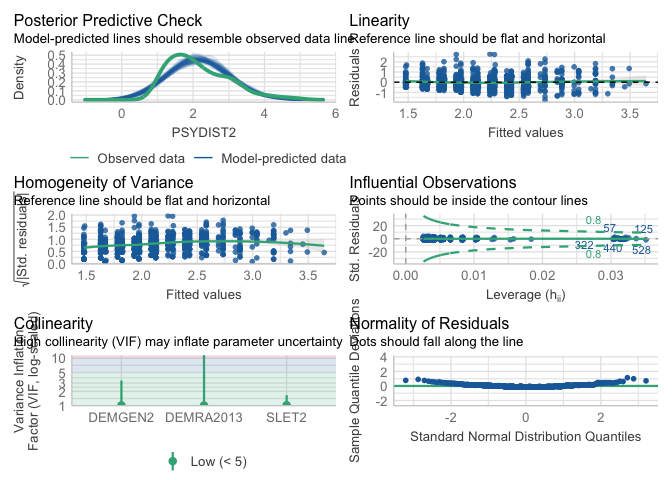

My project
================
2024-10-24

# load packages and dataset

``` r
# Set a CRAN mirror before installing packages
options(repos = c(CRAN = "https://cloud.r-project.org"))

# Install and load the moments package
install.packages("moments")
```

    ## 
    ## The downloaded binary packages are in
    ##  /var/folders/qv/j1c01f7x2l9ctjb7ps7yhmsr0000gn/T//Rtmp2ITjVR/downloaded_packages

``` r
library(moments)
library(haven) #to download the package
library(dplyr) #re-code variable
```

    ## 
    ## Attaching package: 'dplyr'

    ## The following objects are masked from 'package:stats':
    ## 
    ##     filter, lag

    ## The following objects are masked from 'package:base':
    ## 
    ##     intersect, setdiff, setequal, union

``` r
library(ggplot2)

#hope it's the new one, yes it is 
load ("/Users/chenxuejing/Downloads/ICPSR_36850/DS0003/36850-0003-Data.rda")
dataset <- da36850.0003
rm(da36850.0003)
dataset <- dataset %>%
  select(PSYDIST2, SLET2, DEMGEN2, DEMRA2013)
```

``` r
#check normality assumption
# Histogram
ggplot(dataset, aes(x = PSYDIST2)) +
  geom_histogram(binwidth = 0.5, fill = 'blue', color = 'black') +
  ggtitle('Histogram of PSYDIST2') +
  xlab('PSYDIST2') +
  ylab('Frequency')
```

    ## Warning: Removed 3 rows containing non-finite outside the scale range
    ## (`stat_bin()`).

<!-- -->

``` r
#check equal variance assumption
# Install and load car package if not already installed
install.packages("car")
```

    ## 
    ## The downloaded binary packages are in
    ##  /var/folders/qv/j1c01f7x2l9ctjb7ps7yhmsr0000gn/T//Rtmp2ITjVR/downloaded_packages

``` r
library(car)
```

    ## Loading required package: carData

    ## 
    ## Attaching package: 'car'

    ## The following object is masked from 'package:dplyr':
    ## 
    ##     recode

``` r
# Levene's Test for equal variance
leveneTest(PSYDIST2 ~ factor(SLET2), data = dataset)
```

    ## Levene's Test for Homogeneity of Variance (center = median)
    ##        Df F value    Pr(>F)    
    ## group  13  4.0818 1.593e-06 ***
    ##       717                      
    ## ---
    ## Signif. codes:  0 '***' 0.001 '**' 0.01 '*' 0.05 '.' 0.1 ' ' 1

``` r
ggplot(dataset, aes(x = factor(SLET2), y = PSYDIST2)) +
  geom_boxplot(fill = 'lightblue') +
  ggtitle('Boxplot of PSYDIST2 by SLET2') +
  xlab('SLET2') +
  ylab('PSYDIST2')
```

    ## Warning: Removed 3 rows containing non-finite outside the scale range
    ## (`stat_boxplot()`).

<!-- -->

``` r
dataset$PSYDIST2_log <- log(dataset$PSYDIST2)

#check normality assumptions for psydist2_log
skewness(dataset$PSYDIST2_log, na.rm = TRUE)
```

    ## [1] 0.08536127

``` r
kurtosis(dataset$PSYDIST2_log, na.rm = TRUE)
```

    ## [1] 2.261098

``` r
ggplot(dataset, aes(x = factor(SLET2), y = PSYDIST2_log)) +
  geom_boxplot(fill = 'lightblue') +
  ggtitle('Boxplot of PSYDIST2_log by SLET2') +
  xlab('SLET2') +
  ylab('PSYDIST2')
```

    ## Warning: Removed 3 rows containing non-finite outside the scale range
    ## (`stat_boxplot()`).

<!-- -->

``` r
#lab8 
# run the substantive analysis to test my research question. (Correlation model with gender interaction)
library(bruceR)
```

    ## 
    ## bruceR (v2024.6)
    ## Broadly Useful Convenient and Efficient R functions
    ## 
    ## Packages also loaded:
    ## ✔ data.table ✔ emmeans
    ## ✔ dplyr      ✔ lmerTest
    ## ✔ tidyr      ✔ effectsize
    ## ✔ stringr    ✔ performance
    ## ✔ ggplot2    ✔ interactions
    ## 
    ## Main functions of `bruceR`:
    ## cc()             Describe()  TTEST()
    ## add()            Freq()      MANOVA()
    ## .mean()          Corr()      EMMEANS()
    ## set.wd()         Alpha()     PROCESS()
    ## import()         EFA()       model_summary()
    ## print_table()    CFA()       lavaan_summary()
    ## 
    ## For full functionality, please install all dependencies:
    ## install.packages("bruceR", dep=TRUE)
    ## 
    ## Online documentation:
    ## https://psychbruce.github.io/bruceR
    ## 
    ## To use this package in publications, please cite:
    ## Bao, H.-W.-S. (2024). bruceR: Broadly useful convenient and efficient R functions (Version 2024.6) [Computer software]. https://CRAN.R-project.org/package=bruceR

    ## 
    ## These packages are dependencies of `bruceR` but not installed:
    ## - pacman, openxlsx, ggtext, vars, phia, MuMIn, GGally
    ## 
    ## ***** Install all dependencies *****
    ## install.packages("bruceR", dep=TRUE)

``` r
Corr(dataset)
```

    ## NOTE: `DEMGEN2`, `DEMRA2013` transformed to numeric.
    ## 
    ## Pearson's r and 95% confidence intervals:
    ## ──────────────────────────────────────────────────────────
    ##                             r       [95% CI]     p       N
    ## ──────────────────────────────────────────────────────────
    ## PSYDIST2-SLET2           0.53 [ 0.48,  0.58] <.001 *** 731
    ## PSYDIST2-DEMGEN2         0.17 [ 0.10,  0.24] <.001 *** 730
    ## PSYDIST2-DEMRA2013      -0.04 [-0.11,  0.03]  .267     731
    ## PSYDIST2-PSYDIST2_log    0.98 [ 0.97,  0.98] <.001 *** 731
    ## SLET2-DEMGEN2            0.12 [ 0.04,  0.19]  .002 **  731
    ## SLET2-DEMRA2013         -0.09 [-0.16, -0.02]  .017 *   732
    ## SLET2-PSYDIST2_log       0.52 [ 0.47,  0.57] <.001 *** 731
    ## DEMGEN2-DEMRA2013        0.02 [-0.05,  0.09]  .622     733
    ## DEMGEN2-PSYDIST2_log     0.16 [ 0.09,  0.23] <.001 *** 730
    ## DEMRA2013-PSYDIST2_log  -0.04 [-0.11,  0.04]  .321     731
    ## ──────────────────────────────────────────────────────────

<!-- -->

    ## Correlation matrix is displayed in the RStudio `Plots` Pane.

``` r
# there is a significant correlation between my two IVs. Multicollinearity occurs. Try to solve it by standardizing my variables:
# Standardize the 'stressful events' variable (SLET2)
dataset$SLET2_standardized <- scale(dataset$SLET2)

# Convert gender variable (DEMGEN2) to numeric, 0 = male; 1 = female, then standardize it
dataset$DEMGEN2 <- as.numeric(dataset$DEMGEN2)
dataset$DEMGEN2 <- ifelse(dataset$DEMGEN2 == 2, 1, 0)

# Check the result, 332 males and 401 females, then standardize it
table(dataset$DEMGEN2)
```

    ## 
    ##   0   1 
    ## 332 401

``` r
dataset$DEMGEN2_standardized <- scale(dataset$DEMGEN2)

# standardize dependent variable (PSYDIST2) if needed 
dataset$PSYDIST2_standardized <- scale(dataset$PSYDIST2)

# View the standardized data
head(data)
```

    ##                                                                             
    ## 1 function (..., list = character(), package = NULL, lib.loc = NULL,        
    ## 2     verbose = getOption("verbose"), envir = .GlobalEnv, overwrite = TRUE) 
    ## 3 {                                                                         
    ## 4     fileExt <- function(x) {                                              
    ## 5         db <- grepl("\\\\.[^.]+\\\\.(gz|bz2|xz)$", x)                     
    ## 6         ans <- sub(".*\\\\.", "", x)

``` r
#rename the standardized dataset as "data1"
data1 <- dataset %>% 
  select(SLET2_standardized, DEMGEN2_standardized, PSYDIST2_standardized)
Corr(data1)
```

    ## Pearson's r and 95% confidence intervals:
    ## ──────────────────────────────────────────────────────────────────────────
    ##                                               r     [95% CI]     p       N
    ## ──────────────────────────────────────────────────────────────────────────
    ## SLET2_standardized-DEMGEN2_standardized    0.12 [0.04, 0.19]  .002 **  731
    ## SLET2_standardized-PSYDIST2_standardizd    0.53 [0.48, 0.58] <.001 *** 731
    ## DEMGEN2_standardized-PSYDIST2_standardizd  0.17 [0.10, 0.24] <.001 *** 730
    ## ──────────────────────────────────────────────────────────────────────────

<!-- -->

    ## Correlation matrix is displayed in the RStudio `Plots` Pane.

``` r
#moderation:
PROCESS(dataset, y = "PSYDIST2", x = "SLET2", mods = c("DEMGEN2"))
```

    ## 
    ## ****************** PART 1. Regression Model Summary ******************
    ## 
    ## PROCESS Model Code : 1 (Hayes, 2018; www.guilford.com/p/hayes3)
    ## PROCESS Model Type : Simple Moderation
    ## -    Outcome (Y) : PSYDIST2
    ## -  Predictor (X) : SLET2
    ## -  Mediators (M) : -
    ## - Moderators (W) : DEMGEN2
    ## - Covariates (C) : -
    ## -   HLM Clusters : -
    ## 
    ## All numeric predictors have been grand-mean centered.
    ## (For details, please see the help page of PROCESS.)
    ## 
    ## Formula of Outcome:
    ## -    PSYDIST2 ~ SLET2*DEMGEN2
    ## 
    ## CAUTION:
    ##   Fixed effect (coef.) of a predictor involved in an interaction
    ##   denotes its "simple effect/slope" at the other predictor = 0.
    ##   Only when all predictors in an interaction are mean-centered
    ##   can the fixed effect denote the "main effect"!
    ##   
    ## Model Summary
    ## 
    ## ─────────────────────────────────────────
    ##                (1) PSYDIST2  (2) PSYDIST2
    ## ─────────────────────────────────────────
    ## (Intercept)      2.159 ***     2.146 *** 
    ##                 (0.027)       (0.026)    
    ## SLET2            0.156 ***     0.148 *** 
    ##                 (0.009)       (0.009)    
    ## DEMGEN2                        0.200 *** 
    ##                               (0.053)    
    ## SLET2:DEMGEN2                  0.082 *** 
    ##                               (0.019)    
    ## ─────────────────────────────────────────
    ## R^2              0.280         0.311     
    ## Adj. R^2         0.279         0.308     
    ## Num. obs.      730           730         
    ## ─────────────────────────────────────────
    ## Note. * p < .05, ** p < .01, *** p < .001.
    ## 
    ## ************ PART 2. Mediation/Moderation Effect Estimate ************
    ## 
    ## Package Use : ‘interactions’ (v1.2.0)
    ## Effect Type : Simple Moderation (Model 1)
    ## Sample Size : 730 (4 missing observations deleted)
    ## Random Seed : -
    ## Simulations : -
    ## 
    ## Interaction Effect on "PSYDIST2" (Y)
    ## ────────────────────────────────────────
    ##                      F df1 df2     p    
    ## ────────────────────────────────────────
    ## SLET2 * DEMGEN2  19.36   1 726 <.001 ***
    ## ────────────────────────────────────────
    ## 
    ## Simple Slopes: "SLET2" (X) ==> "PSYDIST2" (Y)
    ## ─────────────────────────────────────────────────────────
    ##  "DEMGEN2" Effect    S.E.      t     p           [95% CI]
    ## ─────────────────────────────────────────────────────────
    ##  0.000      0.104 (0.014)  7.266 <.001 *** [0.076, 0.132]
    ##  1.000      0.185 (0.012) 15.589 <.001 *** [0.162, 0.209]
    ## ─────────────────────────────────────────────────────────

``` r
#check if there's a missing value of gender, and there's one row that has missing values 
sum(is.na(dataset$DEMGEN2))
```

    ## [1] 1

``` r
dataset <- dataset[!is.na(dataset$DEMGEN2), ]


ggplot(dataset, aes(x = SLET2, y = PSYDIST2)) + geom_point() + geom_smooth() + theme_bruce()
```

    ## `geom_smooth()` using method = 'loess' and formula = 'y ~ x'

    ## Warning: Removed 3 rows containing non-finite outside the scale range
    ## (`stat_smooth()`).

    ## Warning: Removed 3 rows containing missing values or values outside the scale range
    ## (`geom_point()`).

<!-- -->

``` r
# Plot the interaction effect of stressful events and gender on psychological distress
ggplot(dataset, aes(x = SLET2, y = PSYDIST2, color = factor(DEMGEN2))) + 
  geom_smooth(method = "lm") +  facet_wrap(~DEMGEN2) +
  ggtitle("Interaction of Stressful Events (SLET2) and Gender (DEMGEN2) on Psychological Distress (PSYDIST2)") +
  xlab("Stressful Events (SLET2)") +
  ylab("Psychological Distress (PSYDIST2)") +
  scale_color_discrete(name = "Gender", labels = c("Male", "Female"))
```

    ## `geom_smooth()` using formula = 'y ~ x'

    ## Warning: Removed 3 rows containing non-finite outside the scale range
    ## (`stat_smooth()`).

<!-- -->

``` r
#explanatory research
library(bruceR)
Corr(dataset)
```

    ## NOTE: `DEMRA2013` transformed to numeric.
    ## 
    ## Pearson's r and 95% confidence intervals:
    ## ─────────────────────────────────────────────────────────────────────────────
    ##                                                r       [95% CI]     p       N
    ## ─────────────────────────────────────────────────────────────────────────────
    ## PSYDIST2-SLET2                              0.53 [ 0.47,  0.58] <.001 *** 730
    ## PSYDIST2-DEMGEN2                            0.17 [ 0.10,  0.24] <.001 *** 730
    ## PSYDIST2-DEMRA2013                         -0.04 [-0.11,  0.03]  .262     730
    ## PSYDIST2-PSYDIST2_log                       0.98 [ 0.97,  0.98] <.001 *** 730
    ## PSYDIST2-SLET2_standardized                 0.53 [ 0.47,  0.58] <.001 *** 730
    ## PSYDIST2-DEMGEN2_standardized               0.17 [ 0.10,  0.24] <.001 *** 730
    ## PSYDIST2-PSYDIST2_standardizd               1.00 [  NaN,   NaN] <.001 *** 730
    ## SLET2-DEMGEN2                               0.12 [ 0.04,  0.19]  .002 **  731
    ## SLET2-DEMRA2013                            -0.09 [-0.16, -0.02]  .017 *   731
    ## SLET2-PSYDIST2_log                          0.52 [ 0.47,  0.57] <.001 *** 730
    ## SLET2-SLET2_standardized                    1.00 [ 1.00,  1.00] <.001 *** 731
    ## SLET2-DEMGEN2_standardized                  0.12 [ 0.04,  0.19]  .002 **  731
    ## SLET2-PSYDIST2_standardizd                  0.53 [ 0.47,  0.58] <.001 *** 730
    ## DEMGEN2-DEMRA2013                           0.02 [-0.05,  0.09]  .622     733
    ## DEMGEN2-PSYDIST2_log                        0.16 [ 0.09,  0.23] <.001 *** 730
    ## DEMGEN2-SLET2_standardized                  0.12 [ 0.04,  0.19]  .002 **  731
    ## DEMGEN2-DEMGEN2_standardized                1.00 [ 1.00,  1.00] <.001 *** 733
    ## DEMGEN2-PSYDIST2_standardizd                0.17 [ 0.10,  0.24] <.001 *** 730
    ## DEMRA2013-PSYDIST2_log                     -0.04 [-0.11,  0.04]  .313     730
    ## DEMRA2013-SLET2_standardized               -0.09 [-0.16, -0.02]  .017 *   731
    ## DEMRA2013-DEMGEN2_standardized              0.02 [-0.05,  0.09]  .622     733
    ## DEMRA2013-PSYDIST2_standardizd             -0.04 [-0.11,  0.03]  .262     730
    ## PSYDIST2_log-SLET2_standardized             0.52 [ 0.47,  0.57] <.001 *** 730
    ## PSYDIST2_log-DEMGEN2_standardized           0.16 [ 0.09,  0.23] <.001 *** 730
    ## PSYDIST2_log-PSYDIST2_standardizd           0.98 [ 0.97,  0.98] <.001 *** 730
    ## SLET2_standardized-DEMGEN2_standardized     0.12 [ 0.04,  0.19]  .002 **  731
    ## SLET2_standardized-PSYDIST2_standardizd     0.53 [ 0.47,  0.58] <.001 *** 730
    ## DEMGEN2_standardized-PSYDIST2_standardizd   0.17 [ 0.10,  0.24] <.001 *** 730
    ## ─────────────────────────────────────────────────────────────────────────────

<!-- -->

    ## Correlation matrix is displayed in the RStudio `Plots` Pane.

``` r
#Moderation:
PROCESS(dataset, y = "PSYDIST2", x = "SLET2", mods = c("DEMRA2013"))
```

    ## 
    ## ****************** PART 1. Regression Model Summary ******************
    ## 
    ## PROCESS Model Code : 1 (Hayes, 2018; www.guilford.com/p/hayes3)
    ## PROCESS Model Type : Simple Moderation
    ## -    Outcome (Y) : PSYDIST2
    ## -  Predictor (X) : SLET2
    ## -  Mediators (M) : -
    ## - Moderators (W) : DEMRA2013
    ## - Covariates (C) : -
    ## -   HLM Clusters : -
    ## 
    ## All numeric predictors have been grand-mean centered.
    ## (For details, please see the help page of PROCESS.)
    ## 
    ## Formula of Outcome:
    ## -    PSYDIST2 ~ SLET2*DEMRA2013
    ## 
    ## CAUTION:
    ##   Fixed effect (coef.) of a predictor involved in an interaction
    ##   denotes its "simple effect/slope" at the other predictor = 0.
    ##   Only when all predictors in an interaction are mean-centered
    ##   can the fixed effect denote the "main effect"!
    ##   
    ## Model Summary
    ## 
    ## ──────────────────────────────────────────────────
    ##                         (1) PSYDIST2  (2) PSYDIST2
    ## ──────────────────────────────────────────────────
    ## (Intercept)               2.159 ***     2.159 *** 
    ##                          (0.027)       (0.027)    
    ## SLET2                     0.156 ***     0.156 *** 
    ##                          (0.009)       (0.009)    
    ## DEMRA2013(1) Yes                        0.024     
    ##                                        (0.146)    
    ## SLET2:DEMRA2013(1) Yes                  0.003     
    ##                                        (0.064)    
    ## ──────────────────────────────────────────────────
    ## R^2                       0.280         0.280     
    ## Adj. R^2                  0.279         0.277     
    ## Num. obs.               730           730         
    ## ──────────────────────────────────────────────────
    ## Note. * p < .05, ** p < .01, *** p < .001.
    ## 
    ## ************ PART 2. Mediation/Moderation Effect Estimate ************
    ## 
    ## Package Use : ‘interactions’ (v1.2.0)
    ## Effect Type : Simple Moderation (Model 1)
    ## Sample Size : 730 (3 missing observations deleted)
    ## Random Seed : -
    ## Simulations : -
    ## 
    ## Interaction Effect on "PSYDIST2" (Y)
    ## ─────────────────────────────────────────
    ##                       F df1 df2     p    
    ## ─────────────────────────────────────────
    ## SLET2 * DEMRA2013  0.00   1 726  .957    
    ## ─────────────────────────────────────────
    ## 
    ## Simple Slopes: "SLET2" (X) ==> "PSYDIST2" (Y)
    ## ───────────────────────────────────────────────────────────
    ##  "DEMRA2013" Effect    S.E.      t     p           [95% CI]
    ## ───────────────────────────────────────────────────────────
    ##  (0) No       0.156 (0.009) 16.554 <.001 *** [0.137, 0.174]
    ##  (1) Yes      0.159 (0.064)  2.494  .013 *   [0.034, 0.284]
    ## ───────────────────────────────────────────────────────────

``` r
#visualize my data
ggplot(dataset, aes(x = SLET2, y = PSYDIST2)) + geom_point() + geom_smooth() + theme_bruce()
```

    ## `geom_smooth()` using method = 'loess' and formula = 'y ~ x'

    ## Warning: Removed 3 rows containing non-finite outside the scale range
    ## (`stat_smooth()`).

    ## Warning: Removed 3 rows containing missing values or values outside the scale range
    ## (`geom_point()`).

<!-- -->

``` r
# Plot the interaction effect of stressful events and gender on psychological distress
ggplot(dataset, aes(x = SLET2, y = PSYDIST2, color = factor(DEMRA2013))) + 
  geom_smooth(method = "lm") +  facet_wrap(~DEMRA2013) +
  ggtitle("Interaction of Stressful Events (SLET2) and Gender (DEMGEN2) on Psychological Distress (PSYDIST2)") +
  xlab("Stressful Events (SLET2)") +
  ylab("Psychological Distress (PSYDIST2)") +
  scale_color_discrete(name = "Asian ethinicity", labels = c("Non-Asian", "Asian"))
```

    ## `geom_smooth()` using formula = 'y ~ x'

    ## Warning: Removed 3 rows containing non-finite outside the scale range
    ## (`stat_smooth()`).

<!-- -->
